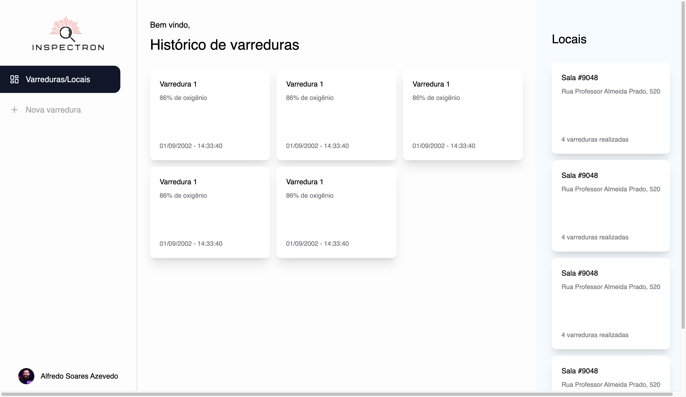
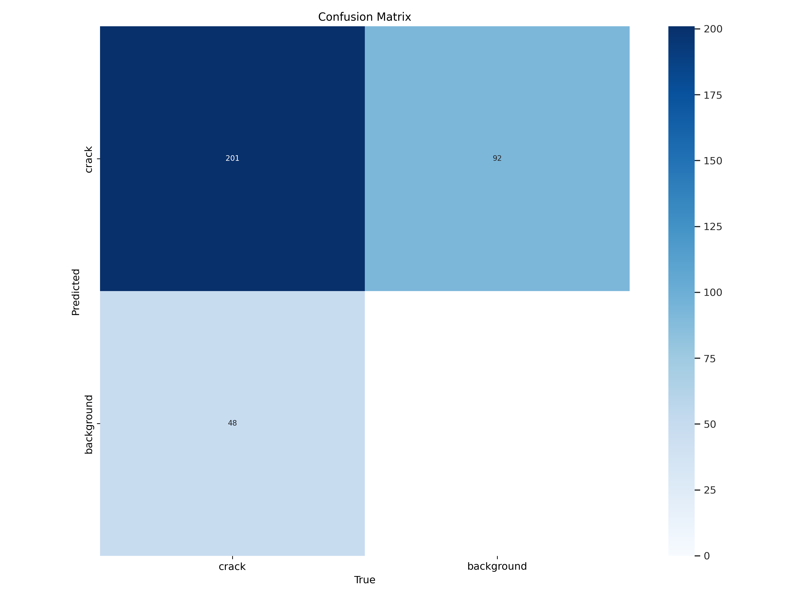
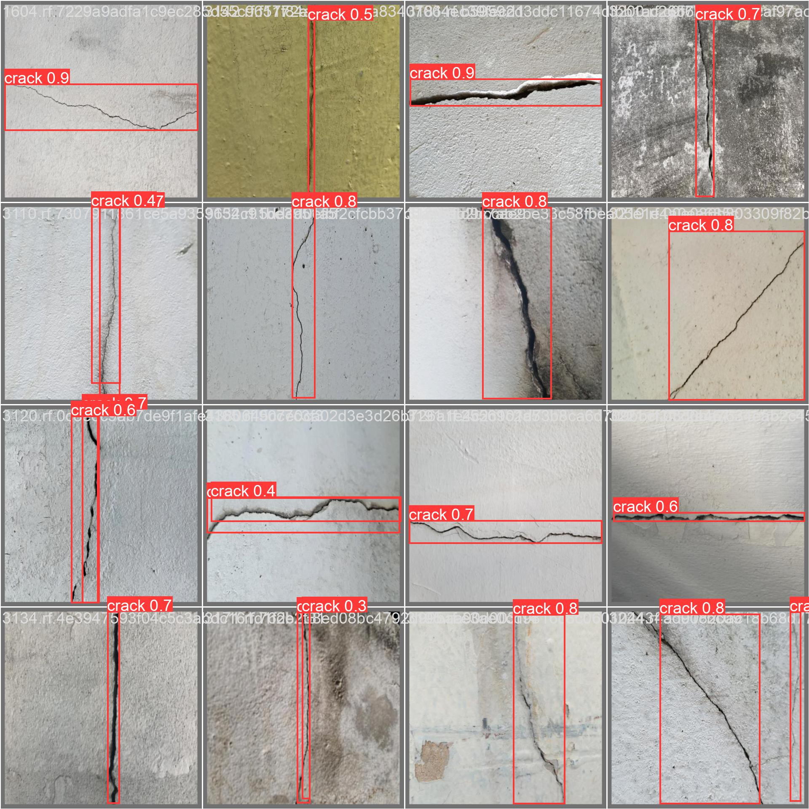
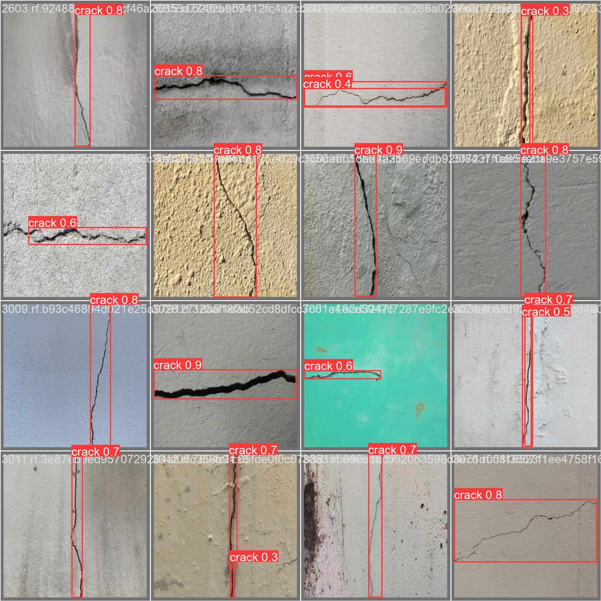

<table>
<tr>
<td>

</td>
<td>
</td>
</tr>
</table>

# Sumário

- [1 - Entendimento de negócio](#1-entendimento-de-negócio)
  - [1.1 - Canvas Proposta de Valor](#11-canvas-proposta-de-valor)
  - [1.2 - Matriz de Riscos](#12-matriz-de-riscos)
  - [1.3 - Oceano Azul](#13-oceano-azul)
  - [1.4 - Análise financeira](#14-análise-financeira)
- [**2** - Entendimento do metadesign](#2-entendimento-do-metadesign)
  - [2.1 - Fatores mercadológicos](#21-fatores-mercadológicos)
  - [2.2 - Sistema produto/design](#22-sistema-produto/design)
  - [2.3 - Sustentabilidade ambiental](#23-sustentabilidade-ambiental)
  - [2.4 - Influências socioculturais](#24-influências-socioculturais)
  - [2.5 - Tipológico-formais e ergonômicos](#25-tipológico-formais-e-ergonômicos)
  - [2.6 - Tecnologia produtiva e materiais empregados](#26-tecnologia-produtiva-e-materiais-empregados)
- [3 - Descrição da arquitetura do sistema](#3-descrição-da-arquitetura-do-sistema)
- [4 - Sistema de locomoção e otimização de rota](#4-sistema-de-locomoção-e-otimização-de-rota)
- [5 - Interface de usuário](#5-interface-de-usuário)
- [6 - Sistema de visão computacional](#6-sistema-de-visão-computacional)
- [7 - Sistemas de segurança](#7-sistemas-de-segurança)
- [8 - Backend](#8-backend)
- [9 - Integração de sistemas](#9-integração-de-sistemas)
- [10 - Validação da eficácia do sistema](#10-validação-da-eficácia-do-sistema)
- [11 - Referências](#11-referências)

---

# 1. Entendimento de negócio.

## 1.1. Canvas Proposta de Valor

O Canvas de Proposta de Valor é uma forma de ajudar criadores de solução a focar naquilo que é importante para o consumidor da solução, priorizando aquilo que gera valor ao produto final. A principal vantagem da proposta de valor apresentada é aumentar a segurança dos colaboradores da Gerdau, melhorar as vistorias realizadas e monitorar em tempo real.

</img>

## 1.2. Matriz de Riscos

Matriz de riscos é uma ferramenta utilizada para identificar, avaliar e priorizar os riscos que podem afetar um projeto, uma empresa ou uma organização. Na matriz os riscos podem ser classificados como baixo, médio ou alto em termos de probabilidade e impacto. A partir da análise é possível identificar quais riscos devem receber mais atenção e quais medidas devem ser tomadas para mitigá-los ou eliminá-los.

</img>

### Ameaças e plano de mitigação

1. Queima de componentes eletrônicos

Para evitar a queima de componentes eletrônicos, é crucial observar e seguir as boas práticas da eletrônica. O primeiro passo é fazer as ligações em um simulador para evitar desperdícios. Em seguida, faz-se a montagem de acordo com a simulação e, antes de ligar o sistema, realiza-se o teste de continuidade. Dessa forma, as chances de queimar qualquer componente são praticamente nulas.

2. Custos elevados para aquisição e manutenção dos equipamentos tecnológicos

Para amenizar os gastos imediatos do projeto, é possível que a Gerdau solicite financiamento a investidores ou instituições financeiras. Dessa forma, a empresa compartilha os potenciais riscos com aqueles que fornecerão o financiamento, de modo a diminuir, consequentemente, a exposição a condições financeiras perigosas.

3. O dispositivo ser frágil para determinados ambientes

Para capacitar o robô a operar em ambientes com condições adversas, pode-se adicionar módulos externos que permitam a operação com segurança. Por exemplo, em espaços confinados de alta temperatura, como fornalhas, fornos ou caldeiras, é possível utilizar um escudo térmico no robô.

4. Divergência nas informações captadas pelos sensores e o estado atual

Para garantir a qualidade das informações dos sensores, deve-se escolher sensores precisos e calibrá-los regularmente. Além disso, é possível utilizar sensores redundantes, para comparar as informações captadas por ele e identificar possíveis incongruências.

### Oportunidades

1. Maior conforto para empresa, ao não arriscar a vida de um funcionário (Automação de uma atividade perigosa)
2. Aumento da precisão na inspeção dos espaços confinados
3. Manutenção preventiva dos locais confinados com maior facilidade
4. Robô realizar com praticidade sua função em locais impossíveis de locomoção humana
5. Demonstrar o compromisso da Gerdau com a segurança de seus colaboradores.
6. Redução dos custos com equipamentos de proteção individual e pessoal treinado para exercer atividades em locais confinados
7. Adaptação dessa tecnologia para outros cenários, desastres naturais, etc

## 1.3. Oceano Azul

O conceito de Oceano Azul é uma abordagem estratégica que pode ajudar a criar novos mercados e a alcançar o sucesso em meio à concorrência acirrada de uma solução. Para realizar a análise foi feita a comparação entre o método atual utilizada pela parceira e a solução que está sendo desenvolvida.

</img>

**Variáveis análisadas:**

1. Custo
2. Qualidade
3. Tecnologia
4. Conforto
5. Intervenção humana
6. Precisão da análise
7. Segurança
8. Praticidade

### Aumentar

- A Qualidade da inspeção irá aumentar pois o robô irá entrar dentro do espaço confinado, diferente do processo atual que é apenas superficial;
- A precisão da análise será elevada pois a inspeção será no interior do espaço que necessita de manutenção;
- Irá melhorar a praticidade pois os colaboradores da Gerdau terão apenas que controlar a dashboard de dados coletador pelo robô;

### Diminuir

- De acordo com dados da análise financeira é perceptivel que o custo da solução irá baratear o processo depois de um certo periodo;
- Realiza a inspeção e coleta de dados em espaços confinados de maneira mais rápida, reduzindo o tempo necessário para realizar essas atividades

### Criar

- Tecnologia será criada pois o processo atual é feito de forma manual;
- Irá criar segurança, uma vez que, os colaboradores não serão expostos ao risco;
- Monitoramento remoto em tempo real, permitindo a análise de dados coletados e a tomada de decisões de forma mais rápida e eficiente.
- Flexibilidade, pois a tecnologia é adaptável às necessidades dos clientes, permitindo a personalização dos recursos para cada cenário.

### Eliminar

- A intervenção humana no processo de vistoria será eliminada pois o robô fara o trabalho de entrada no espaço confinado;
- Erros humanos durante a inspeção e coleta de dados em espaços confinados.

## 1.4. Análise financeira

A análise financeira informa o quanto o parceiro tem projetado para investir no projeto e quais são as projeções de custos e de receitas que o parceiro projeta ter relacionadas ao projeto. Ressalta-se que é uma estimativa feita baseada nos materiais disposibilizados para realizar o MVP, para um processo de real implementação é necessário reavaliar os dispositivos de hardware utilizados.

</img>

\*\* ICMS é a sigla para Imposto sobre Circulação de Mercadorias e Prestação de Serviços de Transporte Interestadual e Intermunicipal e de Comunicação. Regulamentado pela Lei Kandir (Lei complementar 87/1996), é um tributo estadual e seus valores são definidos pelos estados e Distrito Federal.

Ao realizar a análise financeira da solução, constatou-se que o custo total de compra e implementação é de **R$ 10.030,00 no primeiro ano**. Após a compra da solução, os gastos necessários seriam apenas com manutenção e treinamento de novos funcionários, conforme a demanda. Assim, **o retorno sobre o investimento (ROI) seria alcançado em um ano**.

Considerando o salário anual de um funcionário que realiza inspeção em espaço confinado é de R$ 71.500,00 (13 x R$ 5.500,00 - Página da Gerdau no Glassdoor), com esse valor, seria possível implementar 7 robôs e realocar os colaboradores para outras atividades, mediante o treinamento necessário para controlar a solução.

# 2. Entendimento do metadesign

## 2.1. Fatores mercadológicos

### Produto, orientação de mercado e precificação

Um AGV é um tipo de robô autônomo que segue uma trajetória pré-definida por meio de software e utiliza sensores, como câmeras e lasers, para navegar no ambiente e evitar obstáculos. Esses robôs são altamente precisos e seguros, permitindo que se movimentem por espaços apertados com habilidade superior à das mãos humanas. Por essas razões, eles são amplamente utilizados para transportar materiais em ambientes industriais ou logísticos. Além de seu uso para transporte, os AGVs podem ser equipados com sensores e câmeras para realizar a inspeção de áreas de difícil acesso ou perigosas para os humanos. Isso garante mais segurança e precisão na realização da manutenção preventiva.

Durante uma entrevista com um parceiro, foi levantada a questão de que a vistoria de locais confinados é feita apenas pelo lado de fora, o que não permite entender verdadeiramente a condição do espaço. Apesar dos riscos envolvidos, tarefas como limpeza, manutenção e inspeção precisam ser realizadas em espaços confinados. No entanto, devido à dificuldade de acesso, essas atividades podem resultar em várias situações perigosas.

Felizmente, a indústria 4.0 está trazendo soluções para esse problema através da automatização desses processos perigosos. Essa tecnologia aumenta a segurança dos trabalhadores e otimiza os processos, tornando as atividades em espaços confinados mais eficientes e menos perigosas. O projeto criado se orienta para o mercado de segurança e otimização de processos na indústria 4.0. Tal informação pode ser aferida pois o protótipo desenvolvido utiliza recursos avançados, como câmeras, lasers, sensores de proximidade, sensores de gases e outros, para automatizar trabalhos considerados perigosos para os humanos. Além disso, fornece dados em tempo real para uma melhor análise das informações obtidas.

No que se refere à precificação do produto, é importante destacar que os AGVs apresentam uma ampla variação de preços ("How much does an AGV cost?", [s.d.], que podem variar dependendo do tipo de veículo, tamanho, sensores instalados, função e outras possíveis variações. Além disso, é preciso levar em consideração os custos envolvidos na implantação do AGV, tais como o treinamento dos funcionários, a instalação de trilhos ou outras referências de movimento e a integração com outros sistemas de softwares. Para precificar o MVP, será utilizado o TurtleBot3 com os sensores necessários e os investimentos necessários para implementar a solução na empresa parceira.

### Cenário do mercado

Com as mudanças globais em constante evolução, as expectativas dos consumidores e investidores estão se tornando cada vez mais exigentes. Nesse contexto, a Indústria 4.0 surge como um grande integrador de toda a cadeia da indústria, levantando debates importantes sobre o seu desenvolvimento ("Indústria 4.0 no Brasil: cenário e perspectivas", [s.d.]). No Brasil, a implementação da Indústria 4.0 apresenta desafios que vão desde o investimento em equipamentos que incorporem essas tecnologias até a adaptação de processos e formas de relacionamento entre as empresas ao longo da cadeia produtiva, além da criação de novas especialidades e desenvolvimento de competências ("Indústria 4.0", [s.d]).

No entanto, de acordo com a McKinsey, estima-se que até 2025, os processos relacionados à Indústria 4.0 poderão reduzir os custos de manutenção de equipamentos em 10% a 40%, reduzir o consumo de energia entre 10% e 20%, e aumentar a eficiência do trabalho em 10% a 25%. Com isso, é possível concluir que, apesar dos desafios de implementação, a Indústria 4.0 oferece grandes benefícios.

Em ambientes confinados a utilização de robôs tem se mostrado uma alternativa favorável para facilitar vistórias em ambientes restritos e perigosos para seres humanos. De acordo com um relatório da BCC Research, o mercado global de veículos guiados automatizados (AGVs) deve atingir US$ 4 bilhões até 2025. Isso indica que os AGVs estão sendo amplamente adotados pelas indústrias para aumentar a eficiência de suas operações, uma vez que essa tecnologia oferece diversos benefícios, como o diminuição da exposição de trabalhadores a tarefas perigodas e otimização na coleta de dados.

### Visão do projeto proposto

O setor siderúrgico, onde a Gerdau atua, envolve a manipulação de equipamentos e materiais pesados, altas temperaturas e exposição dos trabalhadores a materiais e gases químicos tóxicos, o que o torna um setor de alto risco em termos de segurança do trabalho.

A segurança dos colaboradores é um dos valores primordiais da Gerdau ("Sobre nós", [s.d.]) e, como tal, a empresa busca continuamente formas de garantir maior segurança em suas operações. Neste contexto, um dos principais riscos que causa grande preocupação na Gerdau são os espaços confinados.

O trabalho em espaços confinados é considerado uma das modalidades mais perigosas, já que os colaboradores estão expostos a diversos riscos e o ambiente favorece a ocorrência de acidentes graves e frequentes ("CONECT, E. O que preciso saber sobre trabalho em espaço confinado?", [s.d.]). Em uma conversa com o parceiro, foi constatado que o processo atual é realizado externamente ao espaço e antes da manutenção, o que torna impossível ter uma visão real da situação dentro do espaço confinado.

Nesse cenário, o projeto apresenta uma grande importância para a Gerdau pois tem ação direta em um valor apontado como ideal pela empresa. Ao implementar inspeções sem necessidade de humanos atuando inseguramente dentro dos espaços para vistorias preventivas de manutenção, será possível elevar ainda mais a segurança no trabalho, padrões de qualidade em vistorias e proporcionar maior satisfação e segurança aos colaboradores.

## 2.2. Sistema produto/design

### Missão do projeto

O setor siderúrgico é conhecido por envolver o manuseio de equipamentos e materiais pesados, altas temperaturas e exposição a materiais químicos tóxicos, tornando-o de alto risco em termos de segurança do trabalho. A Gerdau, valorizando a segurança de seus colaboradores ("Sobre nós", [s.d.]), traça objetivos para tornar o desenvolvimento de segurança mais palpável e busca alcançar o objetivo de acidente zero por meio da adoção de rigorosos padrões de operação e manutenção, além de seguir normas nacionais e internacionais de segurança.

A empresa realizou um mapeamento das possíveis ameaças à segurança e identificou que os espaços confinados são um dos riscos mais relevantes em suas operações. Esses espaços não foram projetados para ocupação humana contínua, e a falta de uma rotina de inspeção no interior desses locais pode sujeitar a empresa e seus trabalhadores a eventualidades prejudiciais.

Para solucionar esse problema e estar em linha com sua política de segurança, a Gerdau pretende realizar inspeções em espaços confinados por meio de um AGV (Automated Guided Vehicle), um veículo guiado automaticamente que permitirá que a empresa tenha acesso a informações e imagens do ambiente em tempo real através de um software de integração. Dessa forma, a empresa poderá identificar possíveis vazamentos, problemas na infraestrutura e outros riscos relacionados a espaços confinados e preparar-se corretamente para realizar intervenções seguras.

### Unidade formal entre o design do produto, as formas de divulgação e venda

A solução desenvolvida para a Gerdau é personalizada e não será comercializada em larga escala. Nesse sentido, a abordagem de divulgação e venda deve ser adaptada à visão interna da empresa. É importante manter a coerência em todos os aspectos do projeto, desde a apresentação visual até os requisitos técnicos do produto, para manter uma unidade formal entre o design, a forma de divulgação e a venda. Esses elementos têm um grande impacto na imagem do projeto e da empresa.

Para atingir a excelência nesse objetivo, a criação de um manual de uso do produto é essencial para otimizar a experiência do usuário. Um manual bem elaborado traz diversas vantagens para o projeto, como facilitar a compreensão do sistema e da ideia, tornar a manutenção possível e reduzir possíveis erros de uso, esperados e inesperados.

Além disso, a capacitação dos funcionários, principalmente nos setores que terão contato direto com a solução, é fundamental para o sucesso do projeto. Um teste em ambiente controlado com um técnico especialista pode ser realizado para que os usuários da solução entendam o funcionamento do sistema e observem o sucesso do projeto naquilo que é esperado. Isso aumentará a confiança e o conforto dos trabalhadores na utilização do produto.

## 2.3. Sustentabilidade ambiental

### Ecoeficiente do projeto

O projeto visa uma automatização do processo de varredura de gases em espaços confinados que possibilita análises em diferentes áreas destes. Com o escopo em mente, assume-se que o projeto poderá trazer uma quantidade menor de recursos, onde um único robô poderá fazer varreduras em diversos segmentos, seja em meio a leitura de gases ou gravação do atual estado estrutural do ambiente, sem a necessidade de um operador ser exposto ao risco. ` `

Os principais pontos que justificam o uso de uma nova tecnologia são: ` `

- A identificação dos riscos ambientais relacionados às manutenções que, com o uso da nova solução, pode-se reduzir a liberação de gases tóxicos derivados de um mal fechamento ou falha nas válvulas. ` `
- A adoção de tecnologias ecoeficientes pode contribuir para reduzir os riscos ambientais e promover a segurança do trabalho pois não expõe as equipes de manutenção a um contado de gases tóxicos e situações adiversas. ` `
- O monitoramento em tempo real provido por sensores é fundamental para avaliar a efetividade das medidas de prevenção e controle de riscos ambientais. A análise dos resultados pode contribuir para a implementação de novas medidas preventivas e para a melhoria contínua da segurança do trabalho e da ecoeficiência na empresa.

## 2.4. Influências socioculturais

## 2.5. Tipológico-formais e ergonômicos

## 2.6. Tecnologia produtiva e materiais empregados

# 3. Descrição da arquitetura do sistema.

Nossa arquitetura de solução abrange três áreas de atuação, cada uma desempenhando um papel fundamental:

1. **Embarcado** : Esta parte está presente no próprio robô e engloba todo o controle de movimento e os sensores utilizados, como IMU (Unidade de Medição Inercial), LIDAR (Sensor de Detecção e Alcance de Luz) e Câmera. Esses dispositivos são responsáveis por capturar informações do ambiente e fornecer dados essenciais para o funcionamento autônomo do robô.
2. **Backend** : O sistema de servidor em nuvem constitui o backend da nossa solução. Ele é responsável por fornecer dados provenientes do embarcado para o frontend, bem como armazenar as varreduras realizadas pelo robô e o código necessário para a execução dos trajetos autônomos. O backend é crucial para o processamento e armazenamento eficiente das informações coletadas, garantindo acesso rápido aos dados relevantes quando necessário.
3. **Frontend** : O frontend consiste no principal painel de controle utilizado pelo usuário. Através dele, são apresentados dados sobre as rotinas e funcionalidades do robô. O frontend também permite ao usuário enviar solicitações e comandos indiretos ao robô, utilizando o backend para estabelecer comunicação por meio de requisições HTTP ou Sockets. Esse ambiente de interação intuitivo e amigável permite ao usuário monitorar e controlar o robô remotamente.

Todos os componentes da solução estão conectados através de uma rede Wi-Fi, garantindo uma comunicação contínua entre eles. O ROS2 (Robot Operating System 2) é utilizado para facilitar a comunicação e o envio de comandos entre o backend e o embarcado. Essa plataforma otimiza o sistema de troca de informações, permitindo uma interação eficiente entre as diferentes partes da solução.

# 4. Sistema de locomoção e otimização de rota.

Em face do contexto da nossa aplicação, decidimos empregar o robô e seus sensores para efetuar a movimentação. Desse modo, o robô, ao "adentrar" o espaço confinado, irá percorrer uma rota livre de obstruções, baseando-se em uma análise que fará a partir dos dados dos sensores. Planejamos utilizar principalmente o sensor LIDAR para aumentar a precisão da detecção de pontos entre o robô e a estrutura ou obstruções do local.

Explicando a implementação com mais detalhes, elaboramos um script cuja lógica principal é: se um objeto for identificado pelo sensor (configuramos uma determinada distância para isso), o robô deverá alterar sua rota. Essa mudança pode envolver a continuação do percurso em uma direção diferente ou até mesmo um retorno completo em face de uma obstrução.

Para testar nossa solução, começamos com o simulador Gazebo do ROS, que possui um sensor LIDAR. Com o produto mínimo viável (MVP) desenvolvido, decidimos utilizar o cenário de testes disponibilizado pelo próprio Gazebo, assim, podemos testar a solução atual e quais os possívels problemas a serem encontrados. Durante os testes, percebemos que o atual algoritmo de desvio de obstáculos é eficiente, porém limitado, atualmente o robô só consegue desviar de obstáculos que estão a sua frente e buscar o melhor caminho decidido pelos valores do sensor LIDAR do lado direito e esquerda do robô, então não podemos direcionar para o mesmo alcançar um ponto específico, apenas para que ele desvie de obstáculos.

Fluxo de funcionamento atual:

- O robô inicia o percurso;
- O robô segue em frente até encontrar um obstáculo ( angulo de 330° a 30° );
- O robô identifica o obstáculo, verificar qual dos lados possui o maior espaço livre ( média dos pontos de 60° a 120°, relativo a direita, e 240° a 300°, relativo a esquerda);
- Com a informação de qual lado possui o maior espaço livre, o robô gira para o lado com maior espaço livre até os sensores frontais não identificarem mais o obstáculo;
- Repete o processo inicial;

# 5. Interface de usuário.

O frontend do nosso projeto foi cuidadosamente desenvolvido para proporcionar uma experiência simples e intuitiva ao usuário. Nosso objetivo principal foi permitir que o usuário realize varreduras em salas, visualize todo o histórico de varreduras anteriores e controle diferentes robôs por meio de seus endereços IP. Para atingir isso, implementamos diversas páginas que apresentam maneiras distintas de visualizar as informações armazenadas, como varreduras, locais e robôs.

Nosso sistema utiliza os protocolos HTTP e WebSocket para estabelecer conexões com o backend, dependendo da velocidade e do tipo de informação que precisa ser enviada ou recebida. Essa abordagem flexível nos permite otimizar a comunicação entre o frontend e o backend, garantindo uma interação ágil e eficiente.

Todas as etapas de prototipação do frontend foram realizadas no Figma, uma ferramenta que nos proporcionou a capacidade de criar uma interface sofisticada e altamente personalizada para o nosso projeto. Levamos em consideração todos os detalhes visuais, layouts e fluxos de interação para garantir uma experiência de usuário excepcional.

Além disso, durante o processo de desenvolvimento, priorizamos a usabilidade, buscando simplificar cada interação e garantir que a interface fosse amigável e fácil de usar. Também nos esforçamos para oferecer uma estética visual atraente, combinando cores, tipografia e elementos gráficos de forma harmoniosa.

### Páginas principais:

#### Página de login

A página de login foi meticulosamente projetada para ser a porta de entrada dos usuários em nosso sistema. Reconhecemos a importância crucial da autenticação em nosso projeto, uma vez que apenas usuários autorizados da empresa parceira têm permissão para acessar a plataforma e desfrutar de todas as funcionalidades que ela oferece. Essa abordagem de autenticação garante a segurança e a integridade dos dados, bem como a privacidade das informações armazenadas.

Ao implementar a página de login, consideramos cuidadosamente a experiência do usuário, buscando uma abordagem simplificada que permita um processo de autenticação suave e sem complicações. Utilizamos as melhores práticas de design de interface para garantir que os elementos visuais e a disposição dos elementos na página sejam intuitivos e de fácil compreensão.

A autenticação no nosso sistema é essencial para proteger os recursos disponíveis, como o histórico de varreduras, os locais cadastrados e a capacidade de realizar novas varreduras. Apenas usuários autorizados têm permissão para acessar essas informações e executar ações relacionadas. Isso assegura que apenas aqueles com as devidas credenciais e autorização adequada possam interagir com o sistema e utilizar suas funcionalidades.

#### Página de varreduras/locais

A página de varreduras/locais é um componente essencial do nosso sistema, pois fornece uma visão abrangente e organizada do histórico de todas as varreduras realizadas e locais cadastrados. Nessa página, optamos por agrupar as informações em cards, pois acreditamos que essa abordagem oferece uma forma elegante e intuitiva de apresentar os dados. Cada card contém um resumo conciso e visualmente atraente das informações relacionadas a cada varredura ou local.

Ao agrupar as informações em cards, buscamos proporcionar uma experiência de visualização eficiente, onde os usuários possam facilmente percorrer os diferentes cards e identificar as informações relevantes de forma rápida. Cada card é projetado para fornecer um instantâneo das principais informações, como data da varredura, localização, resultados ou outras métricas relevantes.

Uma funcionalidade importante dessa página é a capacidade de clicar em um card de local e ser redirecionado para uma página específica que exibe todas as varreduras realizadas nessa localização em particular. Essa abordagem permite que os usuários acessem detalhes mais detalhados e aprofundados sobre as varreduras em um local específico.

Além do aspecto visual, também consideramos a usabilidade ao projetar essa página. Planejamos implementar recursos de filtragem e pesquisa para permitir que os usuários encontrem rapidamente as varreduras ou locais desejados, mesmo quando há uma grande quantidade de informações disponíveis. Essa funcionalidade adicional melhoraria a eficiência e a navegabilidade da página, garantindo que os usuários possam encontrar as informações relevantes de maneira ágil.

#### Página de ver todas as varreduras realizadas em um local

Nessa página específica, proporcionamos aos usuários a capacidade de visualizar todas as varreduras realizadas em uma localização específica. Aqui, destacamos nossa abordagem consistente em padronizar a experiência do usuário, evidenciada pelo uso de cards para renderizar as informações. Essa abordagem foi cuidadosamente pensada para criar um senso de continuidade em todo o sistema, levando em consideração as heurísticas de Nielsen.

Ao utilizar cards para apresentar as informações, buscamos oferecer uma experiência visual coesa e intuitiva. Cada card representa uma varredura realizada em um determinado período de tempo, exibindo os principais dados relevantes, como data, informações coletadas e outras métricas pertinentes. Essa padronização na apresentação das informações facilita a compreensão e a navegação do usuário.

Um aspecto importante dessa página é o objetivo de permitir que o usuário compare varreduras em um mesmo local, mas em diferentes períodos de tempo. Ao exibir as varreduras em cards organizados, os usuários têm a capacidade de identificar facilmente as variações nos resultados ao longo do tempo. Essa funcionalidade é valiosa para a análise e monitoramento de dados, permitindo que o usuário identifique tendências, padrões ou anomalias nas varreduras realizadas em uma localização específica.

#### Página de realizar nova varredura

Essa página foi cuidadosamente projetada para permitir que o usuário execute todo o fluxo necessário para realizar uma nova varredura. Ela consiste em duas partes principais:

Na primeira parte, apresentamos uma tela na qual o operador pode selecionar as informações necessárias para iniciar uma nova varredura. Inicialmente, o usuário deve escolher o robô que realizará a varredura. Caso o robô ainda não esteja cadastrado no sistema, é possível clicar no ícone de "+" para cadastrar um novo robô. Ao clicar nesse ícone, uma modal é aberta exibindo um formulário para fornecer as informações desse novo robô.

Em seguida, o usuário deve selecionar o local onde a varredura será realizada. Da mesma forma que para o robô, se o local ainda não estiver cadastrado no sistema, é possível clicar no ícone de "+" para abrir uma modal com um formulário para cadastrar uma nova localização.

Após selecionar as informações necessárias, o usuário deve clicar no botão "Iniciar varredura". Nesse momento, o sistema tenta automaticamente estabelecer uma conexão com o backend e, consequentemente, com o robô selecionado. Durante esse processo de conexão, o sistema exibe uma tela de carregamento para indicar que algo está acontecendo nos bastidores.

A segunda parte da página é exibida quando a conexão é estabelecida com sucesso. Nessa seção, são mostradas informações em tempo real da varredura em andamento, como o vídeo capturado pelo robô, o nível de oxigênio no local, o nível de bateria do robô, entre outras. Além disso, a página também conta com um botão de "Parada de emergência", que pode ser utilizado para interromper completamente o processo.

Essa abordagem permite que o usuário execute de forma eficiente e conveniente o fluxo necessário para iniciar uma nova varredura, com a possibilidade de adicionar novos robôs e locais conforme necessário. A exibição de informações em tempo real e a disponibilidade de uma opção de parada de emergência garantem um acompanhamento seguro e eficaz do processo de varredura.

# 6. Sistema de visão computacional.

O sistema de visão computacional implementado no projeto desempenha um papel crucial ao utilizar o sensor de câmera do robô para detectar e identificar a presença de rachaduras nas paredes durante o processo de varredura.

A aplicação do sistema de visão computacional nesse contexto traz uma série de benefícios. Além de automatizar o processo de detecção de rachaduras, o sistema oferece uma abordagem não invasiva para inspecionar estruturas de locais não propícios a sobrevivência humana, reduzindo a necessidade de intervenção humana direta e potencialmente perigosa. Além disso, a detecção precoce de rachaduras pode ajudar a evitar problemas futuros, permitindo que medidas corretivas sejam tomadas antes que danos mais graves ocorram.

## Modelo de detecção de rachaduras Yolov8

A detecção de rachaduras é de suma importância, especialmente quando o robô realiza varreduras em ambientes que contêm gases tóxicos para seres humanos, como sistemas de tubulação e dutos. Para lidar com esse desafio, optamos por implementar um modelo de inteligência artificial YOLOv8. Ele foi especialmente treinado para reconhecer padrões visuais característicos de rachaduras. Ao processar as imagens capturadas pelo sensor de câmera, o sistema analisa minuciosamente cada pixel, identificando possíveis rachaduras com base em características como formas, texturas e variações de cor. Ao detectar uma rachadura, o sistema automaticamente desenha um quadrado no frame do vídeo correspondente, indicando com precisão ao usuário a localização exata da rachadura detectada.

Acreditamos que a identificação e localização das rachaduras presentes no ambiente de varredura sejam informações cruciais para o nosso parceiro. Essa funcionalidade permite que eles tenham conhecimento prévio das condições estruturais e possam tomar medidas adequadas para a manutenção e reparo, evitando possíveis problemas futuros.

### Pré-processamento da imagem

No desenvolvimento do nosso modelo, optamos por não utilizar técnicas de pré-processamento de imagens, pois constatamos que o YOLOv8 foi capaz de identificar as rachaduras com sucesso mesmo quando treinado apenas com imagens puras.

O YOLOv8 é um modelo de detecção de objetos que se destaca pela sua capacidade de aprender e reconhecer padrões complexos diretamente nas imagens de entrada. Ele utiliza uma arquitetura de rede neural profunda que combina camadas convolucionais e de detecção para identificar objetos em tempo real.

Ao treinar o YOLOv8 com imagens puras, permitimos que o modelo aprenda diretamente com os dados de entrada, sem a necessidade de aplicar técnicas de pré-processamento como filtragem, normalização ou aumento de dados. Isso significa que o modelo é capaz de extrair informações relevantes das imagens sem intervenções adicionais, como a remoção de ruídos ou aprimoramento de contraste.

Essa abordagem simplificada de treinamento é possível graças à capacidade do YOLOv8 de aprender recursos discriminativos em várias escalas e níveis de complexidade. Ele é capaz de capturar características como bordas, texturas e formas diretamente das imagens, o que é essencial para a detecção precisa das rachaduras.

Embora técnicas de pré-processamento de imagens possam ser úteis em determinados cenários, como redução de ruído ou ajuste de iluminação, no nosso caso específico, observamos que o YOLOv8 apresentou um desempenho satisfatório sem a necessidade dessas etapas adicionais. Isso simplifica o fluxo de trabalho e aumenta a eficiência do modelo, permitindo uma detecção eficaz das rachaduras nas imagens capturadas.

### Onde o modelo está sendo utilizado?

Como mencionado nas seções anteriores, a backend do nosso modelo é responsável por receber e processar informações provenientes de diferentes tópicos do ROS.

Um dos tópicos cruciais com os quais a backend está inscrita é o "/streaming". Esse tópico é onde o robô faz a publicação contínua do vídeo que está sendo capturado pelo seu sensor de câmera. Ao enviar os frames de vídeo para esse tópico, o robô permite que a backend tenha acesso em tempo real às imagens da cena, proporcionando assim uma base sólida para a detecção de rachaduras e outras análises visuais.

Ao se inscrever no tópico "/streaming", a backend é capaz de receber as imagens sequenciais e processá-las usando algoritmos de visão computacional. Isso inclui a aplicação do modelo de inteligência artificial YOLOv8, treinado especificamente para identificar rachaduras. Cada frame recebido é analisado pela backend, que realiza a detecção de rachaduras e, em seguida, desenha um retângulo ao redor da área identificada no próprio frame.

Essa interação entre o robô, o tópico "/streaming" e a backend do modelo de visão computacional permite que o sistema seja capaz de detectar e visualizar as rachaduras em tempo real. Essa abordagem é especialmente valiosa em ambientes onde a presença de rachaduras representa um risco significativo, como em sistemas de tubulação e dutos contendo gases tóxicos, pois permite a tomada de ações imediatas para reparo e manutenção.

### Testes de eficácia e performance

Estamos confiantes de que nosso modelo atingiu um alto nível de eficácia na detecção de rachaduras. Para treiná-lo, utilizamos um conjunto de dados robusto, composto por 3.700 imagens, das quais separamos 200 para validação e 112 para teste. Essa divisão dos dados é essencial para avaliar o desempenho do modelo em cenários não vistos durante o treinamento.

Para avaliar a precisão do nosso modelo, realizamos uma análise da matriz de confusão, que fornece informações detalhadas sobre as predições feitas pelo modelo em relação às classes verdadeiras. A matriz de confusão nos permite visualizar as predições corretas (verdadeiros positivos) e incorretas (falsos positivos e falsos negativos) em relação às rachaduras presentes nas imagens de teste.

Além disso, também fornecemos exemplos visuais das predições realizadas pelo modelo em algumas das imagens de teste. Essas imagens destacam como o modelo identifica e delimita as rachaduras nas superfícies, permitindo que os usuários tenham uma visualização clara das capacidades do sistema.

Ao analisar a matriz de confusão e examinar as predições visuais em imagens de teste, podemos ter uma compreensão mais completa da performance do modelo. Isso nos permite avaliar sua capacidade de detectar rachaduras com precisão e identificar possíveis áreas de melhoria.

### Adendo

Além das implementações mencionadas anteriormente, também adicionamos ao nosso projeto uma pasta chamada "/src/model" que contém arquivos específicos para o processo de detecção de rachaduras e treinamento do modelo.

Dentro dessa pasta, encontramos o arquivo "model.py", onde está contido o código responsável por executar o modelo de detecção de rachaduras utilizando a câmera do computador que está executando o arquivo. Essa implementação foi desenvolvida com o propósito de demonstração e testes do modelo em um ambiente controlado. Ao executar esse código, o usuário pode visualizar a detecção de rachaduras em tempo real usando a câmera do computador, permitindo uma compreensão prática do funcionamento do modelo e suas capacidades.

Adicionalmente, no arquivo "training.py", localizado também na pasta "/src/model", está presente o código utilizado para treinar o modelo com as imagens de rachaduras. Esse treinamento é uma etapa crucial para que o modelo seja capaz de realizar uma detecção precisa e confiável. Durante o treinamento, são utilizadas diversas imagens de rachaduras como dados de entrada, permitindo que o modelo aprenda a reconhecer e identificar corretamente esse tipo de padrão visual.

Essas adições ao projeto, tanto o código de detecção de rachaduras em tempo real quanto o código de treinamento do modelo, têm o objetivo de fornecer uma estrutura completa e funcional para o uso da visão computacional na detecção de rachaduras. Com essas implementações, os usuários podem tanto visualizar a detecção de rachaduras em tempo real quanto treinar o modelo com suas próprias imagens de rachaduras, adaptando-o às suas necessidades específicas.

#### Vídeo do funcionamento do modelo a partir da webcam

https://youtu.be/QXdE4vfUh5s

# 7. Sistemas de segurança.

## Mapeamento de riscos dos sistemas eletromecânicos, mecânicos e eletrônicos

No contexto de desenvolvimento um AGV, usado para inspeção em locais confinados, é essencial realizar um mapeamento de riscos dos sistemas eletromecânicos, mecânicos e eletrônicos envolvidos. O objetivo é identificar e compreender os potenciais perigos associados a esses sistemas, a fim de mitigar os riscos e garantir a segurança e integradade de componentes durante as operações do AGV. 

1. **Riscos mecânicos** : Durante a inspeção em um local confinado, o AGV pode encontrar-se em ambientes desafiadores, como dutos, tubulações ou espaços estreitos. Suponhamos que o AGV encontre uma obstrução imprevista, como um objeto sólido. Nesse caso, uma falha em um dos componentes mecânicos, como uma roda, correia, eixo ou sistema de freios, pode resultar em movimentos descontrolados ou instáveis do veículo. Isso aumenta o risco de colisões com obstáculos ou danos aos próprios componentes do AGV.
2. **Riscos elétricos** : Durante a inspeção, o AGV depende de um sistema de alimentação elétrica para fornecer energia aos sistemas eletrônicos e motores. Em um cenário hipotético, consideremos um local confinado com condições ambientais adversas, como alta umidade ou presença de produtos químicos corrosivos. Nessas circunstâncias, pode ocorrer uma falha no sistema de alimentação elétrica, resultando em curto-circuito, sobrecarga ou mesmo incêndio. Esses eventos representam riscos para a integridade dos componentes do AGV e podem comprometer o sucesso da inspeção.
3. **Riscos de colisão** : Embora não haja pessoas próximas, os riscos de colisão com obstáculos continuam sendo uma preocupação importante em ambientes confinados. Suponhamos que o AGV esteja realizando uma inspeção em uma tubulação com curvas acentuadas e estruturas internas. Se o sistema de detecção de obstáculos falhar ou houver um mau funcionamento do sistema de navegação, o AGV pode colidir com as paredes da tubulação ou com objetos presentes, causando danos significativos aos seus componentes e comprometendo a eficácia da inspeção.
4. **Riscos de movimentação** : Durante as operações de inspeção, o AGV precisa realizar movimentos controlados e precisos. No entanto, em um cenário hipotético, um mau funcionamento em um dos sistemas de controle do veículo pode resultar em movimentos imprevistos. Por exemplo, em um ambiente confinado com múltiplas curvas e superfícies escorregadias, uma falha no sistema de controle de tração pode levar a acelerações bruscas, curvas fechadas ou manobras inseguras. Essas situações podem resultar em quedas do AGV, deslizamentos ou até mesmo danos aos componentes.

Para mitigar esses riscos, é fundamental realizar uma análise detalhada dos componentes e sistemas envolvidos no AGV, bem como implementar mecanismos de segurança robustos. Isso pode incluir o uso de sistemas avançados de detecção e prevenção de colisões, sistemas redundantes em componentes críticos, como rodas e freios, e adesão a padrões de segurança relevantes. Além disso, é importante considerar o ambiente em que o AGV será utilizado e adotar medidas de proteção adicionais, como revestimentos resistentes a ambientes corrosivos ou à prova d'água, dependendo das condições específicas encontradas durante a inspeção em locais confinados.

## Definição, implementação e validação de dispositivos de segurança para os riscos mapeados.

Após a identificação e avaliação dos riscos nos sistemas eletromecânicos, mecânicos e eletrônicos do AGV, decidimos definir dispositivos de segurança apropriados para mitigar esses riscos. Esses dispositivos têm o objetivo de prevenir acidentes, reduzir a gravidade das consequências e garantir a segurança das operações do AGV em locais confinados.

1. **Sistemas de detecção de obstáculos** : Para evitar colisões com objetos no ambiente confinado, sensores como câmeras, ultrassom ou sensores de proximidade podem ser instalados no AGV. Esses sensores são capazes de detectar obstáculos próximos ao veículo e fornecer informações em tempo real. Com base nessas informações, algoritmos de controle podem ser implementados para desacelerar ou parar o AGV automaticamente, evitando possíveis colisões.
2. **Sistemas de frenagem/parada de emergência** : Mecanismos de frenagem rápida e eficiente são fundamentais para situações de emergência. Se ocorrer uma falha ou um perigo iminente, é necessário interromper o movimento do AGV o mais rápido possível. Portanto, sistemas de frenagem de emergência devem ser implementados, permitindo uma parada rápida e segura do veículo, evitando acidentes graves.
3. **Sistemas de segurança eletrônica** : É crucial incorporar sistemas eletrônicos de segurança no AGV para proteger seus componentes e prevenir riscos elétricos. Circuitos de proteção contra curto-circuito, sobrecarga ou choque elétrico devem ser integrados aos sistemas elétricos do veículo. Esses sistemas eletrônicos monitoram constantemente a integridade elétrica e garantem a segurança do AGV em diferentes ambientes e cenários, minimizando os riscos de incêndio ou choque elétrico.
4. **Controle de movimentação** : A implementação de algoritmos de controle adequados é essencial para garantir movimentos suaves, estáveis e controlados do AGV. Isso envolve a programação precisa de trajetórias, velocidades e acelerações, evitando manobras bruscas ou imprevistas que possam comprometer a segurança. O controle de movimentação deve levar em consideração os limites físicos do AGV, como a capacidade de frenagem, a estabilidade do veículo e a adaptação a diferentes tipos de terreno.
5. **Treinamento e conscientização** : Além das medidas técnicas, é fundamental fornecer treinamento adequado aos operadores do AGV. Os operadores devem receber instruções claras sobre os riscos envolvidos, procedimentos de segurança e boas práticas a serem seguidas durante as operações em locais confinados. Eles devem estar cientes das características e limitações do AGV, além de receber orientações sobre como agir em situações de emergência. O treinamento contínuo e a conscientização são essenciais para promover uma cultura de segurança e minimizar erros humanos que possam levar a acidentes.

Após a implementação dos dispositivos de segurança, realizamos testes e validações para garantir sua eficácia e conformidade com as normas e regulamentações de segurança aplicáveis. Envolvemos testes de funcionalidade, simulações de cenários de risco e revisões de projeto para garantir que os dispositivos estejam operando corretamente e atendendo aos requisitos de segurança estabelecidos.

## Nossas implementações

## Sensor Lidar

A detecção de obstáculos é uma etapa fundamental para garantir que o robô mapeie os locais da melhor maneira possível, evitando colisões e interações indesejadas com objetos presentes no ambiente. O sensor Lidar é capaz de fornecer informações precisas sobre a proximidade de objetos em torno do robô, permitindo que ele tome decisões de navegação adequadas para evitar possíveis danos a si mesmo e ao ambiente. Atualmente, nossa aplicação dispõem de uma analise constante em quanto em moviemnto de obstruções diante do robô e automatizamos seu desvio. Logo, nos organizamos para utilizar deste sensor em prol da segurança e efetividade nas inpeções que o robô deverá realizar.

# 8. Backend.

## Banco de Dados

O banco de dados é uma ferramenta utilizada para o armazenamento e gerenciamento de informações do sistema. O projeto baseia-se na automação de inspeção de espaços confinados por meio de um AGV, ou seja, deve-se pensar na necessidade de salvamento de espaços, rotas e informações de ambiente captadas pelos sensores do robô.
Neste sentido, é necessário que o banco de dados seja capaz de relacionar duas coleções, _space_ (que representa o espaço confinado em si) e _route_ (que representa as leituras feitas nos determinados espaços).

A seguir está uma imagem da arquitetura de nosso banco de dados:

Explicação detalhada:

A entidade _space_ é composta pelas colunas _id_, _name_ e _coordinates_. O id é a primary key da coleção, ou seja, ele é responsável por fornecer um registro exclusivo a ela. Dessa forma, ele garante que não haja duplicatas na coleção e também possibilita a relação entre as coleções do banco de dados. O _name_ é utilizado para facilitar a identificação e pesquisa de registros do espaço. E por fim, o documento _coordinates_ é utilizado para localizar físicamente o espaço salvo. Ele é do tipo _object_, isso significa que ele precisa de mais de uma informação na sua composição. Para cumprir sua função corretamente no projeto, ele precisa receber uma coordenada x e uma coordenada y.

Já a tabela _route_ é composta pelos documentos _id_, _directions_, _oxygen_ e _space_. O _id_ exerce a mesma função comentada anteriormente. O documento _directions_ é utilizado para salvar a movimentação que o robô faz dentro do espaço. Ele é uma array do tipo _object_ que recebe o enum _direction_, utilizado para dar um valor inteiro para constantes nomeadas e _value_ que metrifica essa movimentação.

A estrutura do enum _direction_ pode ser representada como:
{
Frente: 0
Trás: 1
Esquerda: 2
Direita: 3
}

O documento _oxygen_ representa a deficiência ou enriquecimento de oxigênio medidos em porcentagem captados pelo sensor do robô.

Além disso, essa coleção possui a _Foreign Key_ _space_, que a relaciona com a coleção _space_. A _Foreign Key_ garante a integridade dos dados das duas coleções, tornando possível estabelecer a relação com segurança.

## Servidor

A backend do nosso projeto desempenha um papel crucial ao estabelecer a conexão entre o robô e o frontend, servindo como o ponto de contato com o nosso banco de dados. Nós configuramos três serviços distintos nessa camada, todos interconectados, cada um responsável por um tipo de protocolo específico.

O primeiro serviço é o ROS (Robot Operating System). Na nossa backend, criamos um nó do ROS, encarregado de trocar informações com o robô. Para isso, o nó do ROS se inscreve em tópicos específicos para receber dados e também possui funções para publicar informações em outros tópicos.

O segundo serviço é o WebSocket. Ele é essencial para a troca de informações em tempo real com o frontend. Assim como no ROS, utilizamos o conceito de subscrição e publicação de dados em tópicos específicos. O WebSocket desempenha um papel fundamental na página de nova varredura, onde a necessidade de troca rápida de informações, como vídeo capturado pelo robô e outros dados dos sensores, é primordial.

Por fim, o terceiro serviço é uma API HTTP em Fast. Nessa camada, estabelecemos rotas que permitem ao frontend fazer requisições para obter informações. São nessas rotas que armazenamos e buscamos dados no nosso banco de dados, como informações de localizações ou robôs cadastrados no sistema.

Com essa arquitetura backend robusta e bem estruturada, garantimos uma comunicação eficiente entre o robô, o frontend e o banco de dados, permitindo uma experiência fluida e confiável para os usuários do sistema.

# 9. Integração de sistemas.

# 10. Validação da eficácia do sistema.

# 11. Referências

Página da Gerdau no Glassdorr. Disponível em [https://www.glassdoor.com.br/Vis%C3%A3o-geral/Trabalhar-na-Gerdau-EI_IE7569.13,19.htm](https://www.glassdoor.com.br/Vis%C3%A3o-geral/Trabalhar-na-Gerdau-EI_IE7569.13,19.htm).

A Indústria 4.0 e o futuro da manufatura com a utilização de AGVs – Sinova AGV – Sistema AGV e Solução. Disponível em: [https://www.sinova.com.br/2021/10/22/a-industria-4-0-e-o-futuro-da-manufatura-com-a-utilizacao-de-agvs/](https://www.sinova.com.br/2021/10/22/a-industria-4-0-e-o-futuro-da-manufatura-com-a-utilizacao-de-agvs/).

‌How much does an AGV cost? Disponível em: [https://www.flexqube.com/news/how-much-does-an-agv-cost/#:~:text=AGV%20Forklifts%20have%20an%20estimated](https://www.flexqube.com/news/how-much-does-an-agv-cost/#:~:text=AGV%20Forklifts%20have%20an%20estimated).

‌EDGE-ADMIN. AGV ou AMR? Qual a melhor tecnologia para robôs móveis? - EDGE. Disponível em: [https://edgeglobal.com.br/blog/agv-ou-amr/](https://edgeglobal.com.br/blog/agv-ou-amr/).

‌Veículo autoguiado e os benefícios na indústria 4.0 – Sinova AGV – Sistema AGV e Solução. Disponível em: [https://www.sinova.com.br/2021/03/11/veiculo-autoguiado-e-os-beneficios-na-industria-4-0/](https://www.sinova.com.br/2021/03/11/veiculo-autoguiado-e-os-beneficios-na-industria-4-0/).

‌CONECT, E. O que preciso saber sobre trabalho em espaço confinado? Disponível em: [https://conect.online/blog/o-que-preciso-saber-sobre-trabalho-em-espaco-confinado/](https://conect.online/blog/o-que-preciso-saber-sobre-trabalho-em-espaco-confinado/).

Indústria 4.0 no Brasil: cenário e perspectivas - KPMG Brasil. Disponível em: [https://kpmg.com/br/pt/home/insights/2021/07/industria-4-0.html](https://kpmg.com/br/pt/home/insights/2021/07/industria-4-0.html).

‌Indústria 4.0. Disponível em: [https://www.portaldaindustria.com.br/industria-de-a-z/industria-4-0/](https://www.portaldaindustria.com.br/industria-de-a-z/industria-4-0/).

Veículos Autoguiados: estimativa de mercado da automação industrial – Sinova AGV – Sistema AGV e Solução. Disponível em: [https://www.sinova.com.br/2020/12/22/veiculos-autoguiados-estimativa-de-mercado-da-automacao-industrial/](https://www.sinova.com.br/2020/12/22/veiculos-autoguiados-estimativa-de-mercado-da-automacao-industrial/).

Sobre nós. Disponível em: [https://www2.gerdau.com.br/sobre-nos/](https://www2.gerdau.com.br/sobre-nos/).
