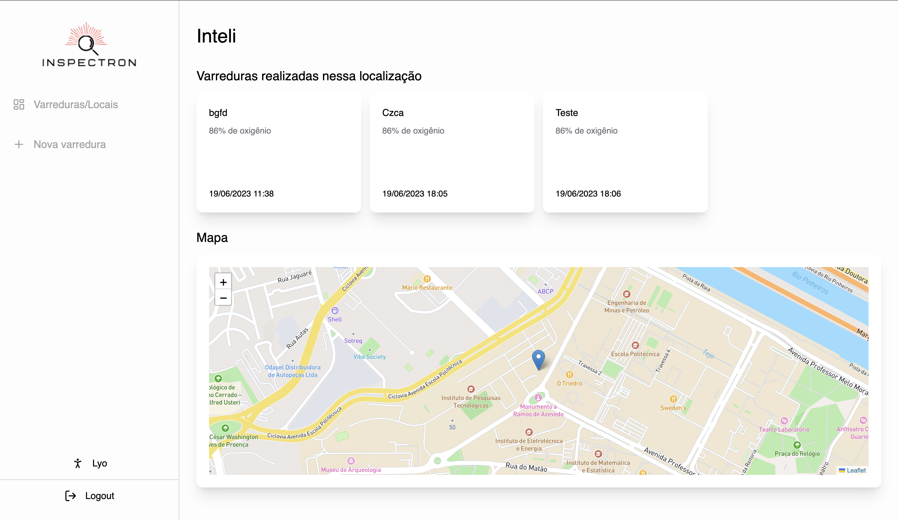
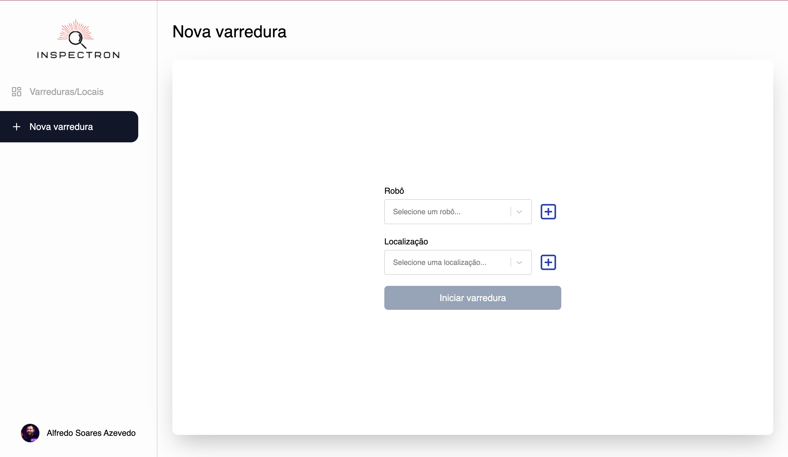
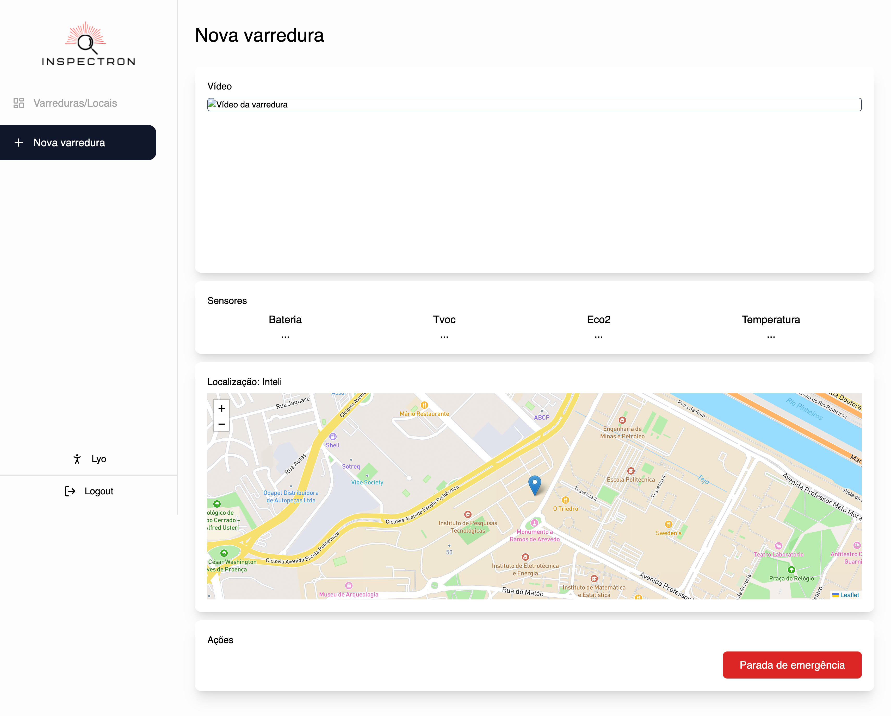

<table>
<tr>
<td>
<a href= "https://www2.gerdau.com.br/"></a>
</td>
<td><a href= "https://www.inteli.edu.br/"></a>
</td>
</tr>
</table>

# Sumário

- [1 - Entendimento de negócio](#1-entendimento-de-negócio)
  - [1.1 - Canvas Proposta de Valor](#11-canvas-proposta-de-valor)
  - [1.2 - Matriz de Riscos](#12-matriz-de-riscos)
  - [1.3 - Oceano Azul](#13-oceano-azul)
    * [1.3.1. - Aumentar](#131-aumentar)
    * [1.3.2. - Diminuir](#132-diminuir)
    * [1.3.3. - Criar](#133-criar)
    * [1.3.4. - Eliminar](#134-eliminar)
  - [1.4 - Análise financeira](#14-análise-financeira)
- [2 - Entendimento do metadesign](#2-entendimento-do-metadesign)
  - [2.1 - Fatores mercadológicos](#21-fatores-mercadológicos)
    - [2.2.1. Produto, orientação de mercado e precificação](#221-produto-orientação-de-mercado-e-precificação)
    - [2.2.2. Cenário do mercado](#222-cenário-o-mercado)
    - [2.2.3. Visão do projeto proposto](#223-visão-do-projeto-proposto)
  - [2.2 - Sistema produto/design](#22-sistema-produto/design)
  - [2.2.1. Missão do projeto ](#221-missao-do-projeto)
  - [2.2.2. Unidade formal entre o design do produto, as formas de divulgação e venda](#222-Unidade-formal-entre-o-design-do-produt-as-formas-de-divulgação-e-venda)
  - [2.3 - Sustentabilidade ambiental](#23-sustentabilidade-ambiental)
    - [2.3.1. Ecoeficiente do projeto](#231-ecoeficiente-do-projeto)
  - [2.4 - Influências socioculturais](#24-influências-socioculturais)
  - [2.5 - Tipológico-formais e ergonômicos](#25-tipológico-formais-e-ergonômicos)
  - [2.6 - Tecnologia produtiva e materiais empregados](#26-tecnologia-produtiva-e-materiais-empregados)
- [3 - Descrição da arquitetura do sistema](#3-descrição-da-arquitetura-do-sistema)
- [4 - Sistema de locomoção e otimização de rota](#4-sistema-de-locomoção-e-otimização-de-rota)
  - [4.1 Movimento em ambiente de simulação](#41-movimento-em-ambiente-de-simulação)
  - [4.2 Movimento do robô físico Turtlebot3](#42-movimento-do-robô-físico-turtlebot3)
    - [4.2.1 Instalação dos pacotes do TurtleBot3 no ROS](#421-instalação-dos-pacotes-do-turtlebot3-no-ros)
    - [4.2.2 Instalação dos pacotes do NAV2 e TurtleBot3](#422-instalação-dos-pacotes-do-nav2-e-turtlebot3)
    - [4.2.3 Configuração das variáveis de ambiente](#423-configuração-das-variáveis-de-ambiente)
    - [4.2.4 Utilização do SLAM para movimentação](#424-utilização-do-slam-para-movimentação)
    - [4.2.5 Verificação do funcionamento](#425-verificação-do-funcionamento)
    - [4.2.6 Mapeamento do ambiente](#426-mapeamento-do-ambiente)
    - [4.2.7 Exportação do mapa](#427-exportação-do-mapa)
    - [4.2.8 Software de movimentação do robô](#428-software-de-movimentação-do-robô)
- [5 - Interface de usuário](#5-interface-de-usuário)
  - [5.1. Páginas principais:](#51-páginas-principais)
- [6 - Sistema de visão computacional](#6-sistema-de-visão-computacional)
  - [6.1. Modelo de detecção de rachaduras Yolov8](#61-modelo-de-detecção-de-rachaduras-Yolov8)
    - [6.1.1. Pré-processamento da imagem](#611-pré-processamento-da-imagem)
    - [6.1.2. Onde o modelo está sendo utilizado?](#612-onde-o-modelo-está-sendo-utilizado?)
    - [6.1.3. Testes de eficácia e performance](#613-testes-de-eficácia-e-performance)
    - [6.1.4. Adendo](#614-adendo)
    - [6.1.5. Vídeo do funcionamento do modelo a partir da webcam](#615-vídeo-do-funcionamento-do-modelo-a-partir-da-webcam)
- [7 - Sistemas de segurança](#7-sistemas-de-segurança)
  - [7.1. Mapeamento de riscos dos sistemas eletromecânicos, mecânicos e eletrônicos](#71-mapeamento-de-riscos-dos-sistemas-eletromecânicos-mecânicos-e-eletrônicos)
  - [7.2. Definição, implementação e validação de dispositivos de segurança para os riscos mapeados.](#72-definição-implementação-e-validação-de-dispositivos-de-segurança-para-os-riscos-mapeados.)
  - [7.3. Nossas implementações](#73-Nossas-implementações)
    - [7.3.1. Sensor Lidar](731-ensor-lidar)
- [8 - Backend](#8-backend)
  - [8.1. Banco de Dados](#81-banco-de-dados)
  - [8.2. Servidor](#82-servidor)
  - [8.3. ROS (Robot Operating System)](#83-ros-robot-operating-system)
  - [8.4. SOCKET.IO](#84-socketio)
  - [8.5. FAST API](#85-fast-api)
  - [8.6. Rotas de Usuário](#86-rotas-de-usuário)
  - [8.7. Rotas de Varreduras](#87-rotas-de-varredura)
  - [8.8. Rotas de Robô](#88-rotas-de-robô)
  - [8.9. Rotas de Localização](#89-rotas-de-localização)
- [9 - Integração de sistemas](#9-integração-de-sistemas)
  - [9.1. Teste de eficácia e performance](#91-teste-de-eficácia-e-performance)
- [10 - Validação da eficácia do sistema](#10-validação-da-eficácia-do-sistema)
  - [10.1. Introdução](#101-introdução)
  - [10.2. Procedimento](#102-procedimento)
  - [10.3. Resultados Esperados](#103-resultados-esperados)
  - [10.4. Conclusão](#104-conclusão)
- [11 - Referências](#11-referências)

---

# 1. Entendimento de negócio.

## 1.1. Canvas Proposta de Valor

O Canvas de Proposta de Valor é uma forma de ajudar criadores de solução a focar naquilo que é importante para o consumidor da solução, priorizando aquilo que gera valor ao produto final. A principal vantagem da proposta de valor apresentada é aumentar a segurança dos colaboradores da Gerdau, melhorar as vistorias realizadas e monitorar em tempo real.

<p align="center"></img></p>

## 1.2. Matriz de Riscos

Matriz de riscos é uma ferramenta utilizada para identificar, avaliar e priorizar os riscos que podem afetar um projeto, uma empresa ou uma organização. Na matriz os riscos podem ser classificados como baixo, médio ou alto em termos de probabilidade e impacto. A partir da análise é possível identificar quais riscos devem receber mais atenção e quais medidas devem ser tomadas para mitigá-los ou eliminá-los.

<p align="center"></img></p>

### Ameaças e plano de mitigação

1. Queima de componentes eletrônicos

Para evitar a queima de componentes eletrônicos, é crucial observar e seguir as boas práticas da eletrônica. O primeiro passo é fazer as ligações em um simulador para evitar desperdícios. Em seguida, faz-se a montagem de acordo com a simulação e, antes de ligar o sistema, realiza-se o teste de continuidade. Dessa forma, as chances de queimar qualquer componente são praticamente nulas.

2. Custos elevados para aquisição e manutenção dos equipamentos tecnológicos

Para amenizar os gastos imediatos do projeto, é possível que a Gerdau solicite financiamento a investidores ou instituições financeiras. Dessa forma, a empresa compartilha os potenciais riscos com aqueles que fornecerão o financiamento, de modo a diminuir, consequentemente, a exposição a condições financeiras perigosas.

3. O dispositivo ser frágil para determinados ambientes

Para capacitar o robô a operar em ambientes com condições adversas, pode-se adicionar módulos externos que permitam a operação com segurança. Por exemplo, em espaços confinados de alta temperatura, como fornalhas, fornos ou caldeiras, é possível utilizar um escudo térmico no robô.

4. Divergência nas informações captadas pelos sensores e o estado atual

Para garantir a qualidade das informações dos sensores, deve-se escolher sensores precisos e calibrá-los regularmente. Além disso, é possível utilizar sensores redundantes, para comparar as informações captadas por ele e identificar possíveis incongruências.

5. Perda de conexão com o robo
6. Camera não identificar rachadura

### Oportunidades

1. Maior conforto para empresa, ao não arriscar a vida de um funcionário (Automação de uma atividade perigosa)
2. Aumento da precisão na inspeção dos espaços confinados
3. Manutenção preventiva dos locais confinados com maior facilidade
4. Robô realizar com praticidade sua função em locais impossíveis de locomoção humana
5. Demonstrar o compromisso da Gerdau com a segurança de seus colaboradores.
6. Redução dos custos com equipamentos de proteção individual e pessoal treinado para exercer atividades em locais confinados
7. Adaptação dessa tecnologia para outros cenários, desastres naturais, etc

## 1.3. Oceano Azul

O conceito de Oceano Azul é uma abordagem estratégica que pode ajudar a criar novos mercados e a alcançar o sucesso em meio à concorrência acirrada de uma solução. Para realizar a análise foi feita a comparação entre o método atual utilizada pela parceira e a solução que está sendo desenvolvida.

<p align="center"></img></p>

**Variáveis análisadas:**

1. Custo
2. Qualidade
3. Tecnologia
4. Conforto
5. Intervenção humana
6. Precisão da análise
7. Segurança
8. Praticidade

### 1.3.1. Aumentar

- A Qualidade da inspeção irá aumentar pois o robô irá entrar dentro do espaço confinado, diferente do processo atual que é apenas superficial;
- A precisão da análise será elevada pois a inspeção será no interior do espaço que necessita de manutenção;
- Irá melhorar a praticidade pois os colaboradores da Gerdau terão apenas que controlar a dashboard de dados coletador pelo robô;

### 1.3.2. Diminuir

- De acordo com dados da análise financeira é perceptivel que o custo da solução irá baratear o processo depois de um certo periodo;
- Realiza a inspeção e coleta de dados em espaços confinados de maneira mais rápida, reduzindo o tempo necessário para realizar essas atividades

### 1.3.3. Criar

- Tecnologia será criada pois o processo atual é feito de forma manual;
- Irá criar segurança, uma vez que, os colaboradores não serão expostos ao risco;
- Monitoramento remoto em tempo real, permitindo a análise de dados coletados e a tomada de decisões de forma mais rápida e eficiente.
- Flexibilidade, pois a tecnologia é adaptável às necessidades dos clientes, permitindo a personalização dos recursos para cada cenário.

### 1.3.4. Eliminar

- A intervenção humana no processo de vistoria será eliminada pois o robô fara o trabalho de entrada no espaço confinado;
- Erros humanos durante a inspeção e coleta de dados em espaços confinados.

## 1.4. Análise financeira

A análise financeira informa o quanto o parceiro tem projetado para investir no projeto e quais são as projeções de custos e de receitas que o parceiro projeta ter relacionadas ao projeto. **Ressalta-se que é uma estimativa feita baseada nos materiais disposibilizados para realizar o MVP, para um processo de real implementação é necessário reavaliar os dispositivos de hardware utilizados.**

<p align="center"></img></p>

\*\* ICMS é a sigla para Imposto sobre Circulação de Mercadorias e Prestação de Serviços de Transporte Interestadual e Intermunicipal e de Comunicação. Regulamentado pela Lei Kandir (Lei complementar 87/1996), é um tributo estadual e seus valores são definidos pelos estados e Distrito Federal.

Ao realizar a análise financeira da solução, constatou-se que o custo total de compra e implementação é de **R$ 10.099,16 no primeiro ano**. Após a compra da solução, os gastos necessários seriam apenas com manutenção e treinamento de novos funcionários, conforme a demanda. Assim, **o retorno sobre o investimento (ROI) seria alcançado em um ano**.

Considerando o salário anual de um funcionário que realiza inspeção em espaço confinado é de R$ 71.500,00 (13 x R$ 5.500,00 - Página da Gerdau no Glassdoor), com esse valor, seria possível implementar 7 robôs e realocar os colaboradores para outras atividades, mediante o treinamento necessário para controlar a solução.

# 2. Entendimento do metadesign

## 2.1. Fatores mercadológicos

### 2.1.1. Produto, orientação de mercado e precificação

Um AGV é um tipo de robô autônomo que segue uma trajetória pré-definida por meio de software e utiliza sensores, como câmeras e lasers, para navegar no ambiente e evitar obstáculos. Esses robôs são altamente precisos e seguros, permitindo que se movimentem por espaços apertados com habilidade superior à das mãos humanas. Por essas razões, eles são amplamente utilizados para transportar materiais em ambientes industriais ou logísticos. Além de seu uso para transporte, os AGVs podem ser equipados com sensores e câmeras para realizar a inspeção de áreas de difícil acesso ou perigosas para os humanos. Isso garante mais segurança e precisão na realização da manutenção preventiva.

Durante uma entrevista com um parceiro, foi levantada a questão de que a vistoria de locais confinados é feita apenas pelo lado de fora, o que não permite entender verdadeiramente a condição do espaço. Apesar dos riscos envolvidos, tarefas como limpeza, manutenção e inspeção precisam ser realizadas em espaços confinados. No entanto, devido à dificuldade de acesso, essas atividades podem resultar em várias situações perigosas.

Felizmente, a indústria 4.0 está trazendo soluções para esse problema através da automatização desses processos perigosos. Essa tecnologia aumenta a segurança dos trabalhadores e otimiza os processos, tornando as atividades em espaços confinados mais eficientes e menos perigosas. O projeto criado se orienta para o mercado de segurança e otimização de processos na indústria 4.0. Tal informação pode ser aferida pois o protótipo desenvolvido utiliza recursos avançados, como câmeras, lasers, sensores de proximidade, sensores de gases e outros, para automatizar trabalhos considerados perigosos para os humanos. Além disso, fornece dados em tempo real para uma melhor análise das informações obtidas.

No que se refere à precificação do produto, é importante destacar que os AGVs apresentam uma ampla variação de preços ("How much does an AGV cost?", [s.d.], que podem variar dependendo do tipo de veículo, tamanho, sensores instalados, função e outras possíveis variações. Além disso, é preciso levar em consideração os custos envolvidos na implantação do AGV, tais como o treinamento dos funcionários, a instalação de trilhos ou outras referências de movimento e a integração com outros sistemas de softwares. Para precificar o MVP, será utilizado o TurtleBot3 com os sensores necessários e os investimentos necessários para implementar a solução na empresa parceira.

### 2.1.2. Cenário do mercado

Com as mudanças globais em constante evolução, as expectativas dos consumidores e investidores estão se tornando cada vez mais exigentes. Nesse contexto, a Indústria 4.0 surge como um grande integrador de toda a cadeia da indústria, levantando debates importantes sobre o seu desenvolvimento ("Indústria 4.0 no Brasil: cenário e perspectivas", [s.d.]). No Brasil, a implementação da Indústria 4.0 apresenta desafios que vão desde o investimento em equipamentos que incorporem essas tecnologias até a adaptação de processos e formas de relacionamento entre as empresas ao longo da cadeia produtiva, além da criação de novas especialidades e desenvolvimento de competências ("Indústria 4.0", [s.d]).

No entanto, de acordo com a McKinsey, estima-se que até 2025, os processos relacionados à Indústria 4.0 poderão reduzir os custos de manutenção de equipamentos em 10% a 40%, reduzir o consumo de energia entre 10% e 20%, e aumentar a eficiência do trabalho em 10% a 25%. Com isso, é possível concluir que, apesar dos desafios de implementação, a Indústria 4.0 oferece grandes benefícios.

Em ambientes confinados a utilização de robôs tem se mostrado uma alternativa favorável para facilitar vistórias em ambientes restritos e perigosos para seres humanos. De acordo com um relatório da BCC Research, o mercado global de veículos guiados automatizados (AGVs) deve atingir US$ 4 bilhões até 2025. Isso indica que os AGVs estão sendo amplamente adotados pelas indústrias para aumentar a eficiência de suas operações, uma vez que essa tecnologia oferece diversos benefícios, como o diminuição da exposição de trabalhadores a tarefas perigodas e otimização na coleta de dados.

### 2.1.3. Visão do projeto proposto

O setor siderúrgico, onde a Gerdau atua, envolve a manipulação de equipamentos e materiais pesados, altas temperaturas e exposição dos trabalhadores a materiais e gases químicos tóxicos, o que o torna um setor de alto risco em termos de segurança do trabalho.

A segurança dos colaboradores é um dos valores primordiais da Gerdau ("Sobre nós", [s.d.]) e, como tal, a empresa busca continuamente formas de garantir maior segurança em suas operações. Neste contexto, um dos principais riscos que causa grande preocupação na Gerdau são os espaços confinados.

O trabalho em espaços confinados é considerado uma das modalidades mais perigosas, já que os colaboradores estão expostos a diversos riscos e o ambiente favorece a ocorrência de acidentes graves e frequentes ("CONECT, E. O que preciso saber sobre trabalho em espaço confinado?", [s.d.]). Em uma conversa com o parceiro, foi constatado que o processo atual é realizado externamente ao espaço e antes da manutenção, o que torna impossível ter uma visão real da situação dentro do espaço confinado.

Nesse cenário, o projeto apresenta uma grande importância para a Gerdau pois tem ação direta em um valor apontado como ideal pela empresa. Ao implementar inspeções sem necessidade de humanos atuando inseguramente dentro dos espaços para vistorias preventivas de manutenção, será possível elevar ainda mais a segurança no trabalho, padrões de qualidade em vistorias e proporcionar maior satisfação e segurança aos colaboradores.

## 2.2. Sistema produto/design

### 2.2.1. Missão do projeto

O setor siderúrgico é conhecido por envolver o manuseio de equipamentos e materiais pesados, altas temperaturas e exposição a materiais químicos tóxicos, tornando-o de alto risco em termos de segurança do trabalho. A Gerdau, valorizando a segurança de seus colaboradores ("Sobre nós", [s.d.]), traça objetivos para tornar o desenvolvimento de segurança mais palpável e busca alcançar o objetivo de acidente zero por meio da adoção de rigorosos padrões de operação e manutenção, além de seguir normas nacionais e internacionais de segurança.

A empresa realizou um mapeamento das possíveis ameaças à segurança e identificou que os espaços confinados são um dos riscos mais relevantes em suas operações. Esses espaços não foram projetados para ocupação humana contínua, e a falta de uma rotina de inspeção no interior desses locais pode sujeitar a empresa e seus trabalhadores a eventualidades prejudiciais.

Para solucionar esse problema e estar em linha com sua política de segurança, a Gerdau pretende realizar inspeções em espaços confinados por meio de um AGV (Automated Guided Vehicle), um veículo guiado automaticamente que permitirá que a empresa tenha acesso a informações e imagens do ambiente em tempo real através de um software de integração. Dessa forma, a empresa poderá identificar possíveis vazamentos, problemas na infraestrutura e outros riscos relacionados a espaços confinados e preparar-se corretamente para realizar intervenções seguras.

### 2.2.2. Unidade formal entre o design do produto, as formas de divulgação e venda

A solução desenvolvida para a Gerdau é personalizada e não será comercializada em larga escala. Nesse sentido, a abordagem de divulgação e venda deve ser adaptada à visão interna da empresa. É importante manter a coerência em todos os aspectos do projeto, desde a apresentação visual até os requisitos técnicos do produto, para manter uma unidade formal entre o design, a forma de divulgação e a venda. Esses elementos têm um grande impacto na imagem do projeto e da empresa.

Para atingir a excelência nesse objetivo, a criação de um manual de uso do produto é essencial para otimizar a experiência do usuário. Um manual bem elaborado traz diversas vantagens para o projeto, como facilitar a compreensão do sistema e da ideia, tornar a manutenção possível e reduzir possíveis erros de uso, esperados e inesperados.

Além disso, a capacitação dos funcionários, principalmente nos setores que terão contato direto com a solução, é fundamental para o sucesso do projeto. Um teste em ambiente controlado com um técnico especialista pode ser realizado para que os usuários da solução entendam o funcionamento do sistema e observem o sucesso do projeto naquilo que é esperado. Isso aumentará a confiança e o conforto dos trabalhadores na utilização do produto.

## 2.3. Sustentabilidade ambiental

### 2.3.1. Ecoeficiente do projeto

O projeto visa uma automatização do processo de varredura de gases em espaços confinados que possibilita análises em diferentes áreas destes. Com o escopo em mente, assume-se que o projeto poderá trazer uma quantidade menor de recursos, onde um único robô poderá fazer varreduras em diversos segmentos, seja em meio a leitura de gases ou gravação do atual estado estrutural do ambiente, sem a necessidade de um operador ser exposto ao risco.

Os principais pontos que justificam o uso de uma nova tecnologia são:

- A identificação dos riscos ambientais relacionados às manutenções que, com o uso da nova solução, pode-se reduzir a liberação de gases tóxicos derivados de um mal fechamento ou falha nas válvulas.
- A adoção de tecnologias ecoeficientes pode contribuir para reduzir os riscos ambientais e promover a segurança do trabalho pois não expõe as equipes de manutenção a um contado de gases tóxicos e situações adiversas.
- O monitoramento em tempo real provido por sensores é fundamental para avaliar a efetividade das medidas de prevenção e controle de riscos ambientais. A análise dos resultados pode contribuir para a implementação de novas medidas preventivas e para a melhoria contínua da segurança do trabalho e da ecoeficiência na empresa.

## 2.4. Influências socioculturais

Com o objetivo de manter uma relação sociocultural favorável, o projeto busca assegurar a segurança dos trabalhadores. Um dos principais impactos é garantir ao operador a segurança necessária ao adentrar em espaços confinados, reduzindo os riscos de acidentes e proporcionando maior tranquilidade aos operários. Esses aspectos influenciam a cultura organizacional da empresa, promovendo um ambiente de trabalho valorizado e respeitoso.

A introdução de tecnologias robóticas e autônomas, como o TurtleBot, pode resultar em mudanças nas habilidades requeridas para a realização de certas tarefas. Os operadores precisam adquirir novos conhecimentos e competências para operar e supervisionar o sistema. Isso pode afetar a formação profissional e demandar investimentos em treinamento e capacitação. Além disso, pode ocorrer uma redistribuição de tarefas, substituindo trabalhos manuais repetitivos pela automação, enquanto outros se concentram em tarefas mais complexas que requerem interação humana.

Aceitação e adaptação à tecnologia: A introdução de robôs autônomos no ambiente de trabalho pode exigir uma mudança de mentalidade e cultura organizacional. Pode ser necessário um período de adaptação para que os trabalhadores se acostumem e confiem na tecnologia. Também pode haver resistência inicial devido ao receio de substituição de empregos. Portanto, é essencial promover conscientização, participação e colaboração dos trabalhadores no processo de implementação, fornecendo suporte e treinamento adequados.

## 2.5. Tipológico-formais e ergonômicos

A aplicação das abordagens tipológico-formais e ergonômicas no uso de um AGV é fundamental para garantir sua eficácia e segurança em diferentes ambientes e atividades. O Turtlebot3 Burger é um veículo autônomo guiado por sistemas automatizados, projetado para executar Pesquisa em robótica, Desenvolvimento de aplicações robóticas e Demonstração de conceitos robóticos. Em nosso projeto, usamos para fazer prova de conceito, demonstrando sua eficiência em varreduras em espaços confinados.

No aspecto tipológico-formal, é importante considerar as características físicas e funcionais do ambiente onde o TurtleBot será utilizado. Cada ambiente pode apresentar obstáculos, espaços estreitos, diferentes superfícies ou até mesmo diferentes níveis de altura. Ao projetá-lo, foi necessário analisar esses aspectos para criar maneiras de contorná-las e aprimorá-las. Isso inclui a escolha dos sensores e da maneira que programamos o robô para evitar colisões com obstáculos.

A abordagem ergonômica no uso de um AGV refere-se à interação entre o veículo e as pessoas que o utilizam. Mesmo que o AGV seja autônomo, foi importante projetar uma interface intuitiva e amigável para facilitar a interação com os operadores ou outros funcionários que possam estar envolvidos na sua operação ou manutenção. Isso inclui painéis de controle de fácil compreensão, recursos de visualização em tempo real, recursos de relatórios fáceis e indicadores visuais, para transmitir informações relevantes sobre o status da operação.
Além disso, o design do robô foi planejado de forma com que atenda aos requisitos do ambiente e de manutenção. Ele apresenta uma fácil instalação de sensores e não necessita um grande espaço de armazenamento, já que o mesmo, é pequeno e de fácil manuseio.

## 2.6. Tecnologia produtiva e materiais empregados

O TurtleBot 3 Burger destaca-se por sua estrutura simples e compacta, predominantemente feita de plástico resistente, o que o torna leve e durável. Além disso, o fato de ser fabricado com materiais recicláveis ressalta sua preocupação com a sustentabilidade.

Uma das características notáveis desse robô é a variedade de placas eletrônicas disponíveis, incluindo uma placa controladora principal e uma placa de interface. Essas placas oferecem flexibilidade de uso, atendendo tanto a propósitos acadêmicos como a projetos de maior escala.

O TurtleBot 3 Burger possui uma gama de sensores, como umidade, oxigênio e GPS, que fornecem dados em tempo real. Além disso, conta com uma câmera acoplada que possibilita a visualização em tempo real, permitindo a identificação de rachaduras ao longo do trajeto.

Para garantir sua mobilidade, o robô é equipado com rodas omnidirecionais, que oferecem a capacidade de se movimentar em diferentes direções. Essas rodas são fabricadas geralmente com plástico resistente e possuem superfícies emborrachadas para proporcionar tração adequada.

Em resumo, o TurtleBot 3 Burger se destaca por sua estrutura leve e durável, fabricada principalmente com plástico resistente e reciclável. Sua ampla variedade de placas eletrônicas possibilita a sua utilização em diferentes contextos, desde fins acadêmicos até projetos mais complexos. Os diversos sensores e a câmera acoplada proporcionam a obtenção de dados em tempo real e a detecção de rachaduras, enquanto suas rodas omnidirecionais garantem uma mobilidade versátil e eficiente.

# 3. Descrição da arquitetura do sistema.

Nossa arquitetura de solução abrange três áreas de atuação, cada uma desempenhando um papel fundamental:

1. **Embarcado** : Esta parte está presente no próprio robô e engloba todo o controle de movimento e os sensores utilizados, como IMU (Unidade de Medição Inercial), LIDAR (Sensor de Detecção e Alcance de Luz) e Câmera. Esses dispositivos são responsáveis por capturar informações do ambiente e fornecer dados essenciais para o funcionamento autônomo do robô.
2. **Backend** : O sistema de servidor em nuvem constitui o backend da nossa solução. Ele é responsável por fornecer dados provenientes do embarcado para o frontend, bem como armazenar as varreduras realizadas pelo robô e o código necessário para a execução dos trajetos autônomos. O backend é crucial para o processamento e armazenamento eficiente das informações coletadas, garantindo acesso rápido aos dados relevantes quando necessário.
3. **Frontend** : O frontend consiste no principal painel de controle utilizado pelo usuário. Através dele, são apresentados dados sobre as rotinas e funcionalidades do robô. O frontend também permite ao usuário enviar solicitações e comandos indiretos ao robô, utilizando o backend para estabelecer comunicação por meio de requisições HTTP ou Sockets. Esse ambiente de interação intuitivo e amigável permite ao usuário monitorar e controlar o robô remotamente.

Todos os componentes da solução estão conectados através de uma rede Wi-Fi, garantindo uma comunicação contínua entre eles. O ROS2 (Robot Operating System 2) é utilizado para facilitar a comunicação e o envio de comandos entre o backend e o embarcado. Essa plataforma otimiza o sistema de troca de informações, permitindo uma interação eficiente entre as diferentes partes da solução.

<p align="center"></img></p>

# 4. Sistema de locomoção e otimização de rota.

## 4.1 Movimento em ambiente de simulação

Em face do contexto da nossa aplicação, decidimos empregar o robô para efetuar a movimentação de forma autônoma. Desse modo, o robô, ao "adentrar" o espaço confinado, irá percorrer uma rota livre de obstruções, baseando-se em uma análise que fará a partir dos dados dos sensores. Planejamos utilizar principalmente o sensor LIDAR para aumentar a precisão da detecção de pontos entre o robô e a estrutura ou obstruções do local.

Explicando a implementação com mais detalhes, elaboramos um script cuja lógica principal é: se um objeto for identificado pelo sensor (configuramos uma determinada distância para isso), o robô deverá alterar sua rota. Essa mudança pode envolver a continuação do percurso em uma direção diferente ou até mesmo um retorno completo em face de uma obstrução.

Para testar nossa solução, começamos com o simulador Gazebo do ROS, que possui um sensor LIDAR. Com o produto mínimo viável (MVP) desenvolvido, decidimos utilizar o cenário de testes disponibilizado pelo próprio Gazebo, assim, podemos testar a solução atual e quais os possívels problemas a serem encontrados. Durante os testes, percebemos que o atual algoritmo de desvio de obstáculos é eficiente, porém limitado, atualmente o robô só consegue desviar de obstáculos que estão a sua frente e buscar o melhor caminho decidido pelos valores do sensor LIDAR do lado direito e esquerda do robô, então não podemos direcionar para o mesmo alcançar um ponto específico, apenas para que ele desvie de obstáculos.

Fluxo de funcionamento no ambiente de simulação (Gazebo):

- O robô inicia o percurso;
- O robô segue em frente até encontrar um obstáculo ( angulo de 330° a 30° );
- O robô identifica o obstáculo, verificar qual dos lados possui o maior espaço livre ( média dos pontos de 60° a 120°, relativo a direita, e 240° a 300°, relativo a esquerda);
- Com a informação de qual lado possui o maior espaço livre, o robô gira para o lado com maior espaço livre até os sensores frontais não identificarem mais o obstáculo;
- Repete o processo inicial;

## 4.2 Movimento do robô físico Turtlebot3

A movimentação física do robô TurtleBot3 é realizada por meio do NAV2, um sistema de navegação autônomo desenvolvido especificamente para esse robô. O NAV2 é baseado na estrutura de software Navigation Stack do ROS (Robot Operating System) e oferece recursos avançados de navegação para o TurtleBot3, permitindo que ele se mova de forma autônoma em um ambiente, evitando obstáculos e alcançando destinos desejados.

O NAV2 utiliza algoritmos como o SLAM (Simultaneous Localization and Mapping) para construir mapas do ambiente e localizar o TurtleBot3 dentro desses mapas. Também utiliza o algoritmo de planejamento de trajetórias para determinar a melhor rota para o robô seguir, levando em consideração os obstáculos presentes no ambiente.

Para utilizar o NAV2, é necessário atender a alguns requisitos e realizar algumas etapas de instalação e configuração. A seguir, são apresentados os passos necessários:

**Requisitos:**

- Utilizar um sistema operacional Linux.
- Ter os pacotes ROS2 (Robot Operating System) instalados.

Os passos abaixo demonstam como executar o NAV2:

### 4.2.1 Instalação dos pacotes do TurtleBot3 no ROS

Execute o seguinte comando no terminal:

```
sudo apt install ros-humble-turtlebot3*
```

### 4.2.2 Instalação dos pacotes do NAV2 e TurtleBot3

Execute os seguintes comandos no terminal (um de cada vez):

```
sudo apt install ros-humble-slam-toolbox
sudo apt install ros-humble-navigation2
sudo apt install ros-humble-distro>-nav2-bringup
sudo apt install ros-humble-turtlebot3-gazebo
```

### 4.2.3 Configuração das variáveis de ambiente

Execute os seguintes comandos no terminal (um de cada vez):

```
source /opt/ros/humble/setup.bash
export TURTLEBOT3_MODEL=burger
source .bashrc
```

### 4.2.4 Utilização do SLAM para movimentação

Abrir três terminais diferentes para entrar no robô Turtlebot3 via ssh e em cada um deles seguir rodar o seguinte comando:

```
ssh inteli@grupo1.local
Senha: irolandinho
```

**Importante: Verificar se o robô e o computador então conectador na mesma rede wifi.**

Após rodar esse comando nos três termianis aberto, colocar os comandos abaixo:

**Terminal 1:**

```
ros2 launch turtlebot3_bringup robot.launch.py
```

**Terminal 2:**

```
ros2 launch nav2_bringup navigation_launch.py
```

**Terminal 3:**

```
ros2 launch slam_toolbox online_async_launch.py
```

### 4.2.5 Verificação do funcionamento

Em um novo terminal no seu dispositivo, execute o seguinte comando:

```
ros2 topic list
```

Verifique se o tópico "/map" está listado para confirmar o funcionamento adequado.

### 4.2.6 Mapeamento do ambiente

Para mapear o ambiente em que o robô se movimentará, execute o seguinte comando em um terminal:

```
ros2 run turtlebot3_teleop teleop_keyboard
```

Use as teclas 's', 'w', 'a', 'd' e 'x' para mover o robô pelo ambiente.

### 4.2.7 Exportação do mapa

Em um novo terminal, execute o seguinte comando:

```
ros2 run nav2_map_server map_saver_cli -f ~/map
```

Isso irá gerar um arquivo "map.yaml" na pasta home do computador, contendo o mapa do ambiente mapeado. Ao abrir o mapa, o mapa será algo parecido com a figura abaixo (de acordo com o ambiente mapeado):


### 4.2.8 Software de movimentação do robô

Execute os seguintes comandos em dois terminais diferentes:

**Terminal 1:**

```
ros2 launch nav2_bringup bringup_launch.py use_sim_time:=False autostart:=False map:=~/map.yaml
```

**Terminal 2:**

```
ros2 run rviz2 rviz2 -d $(ros2 pkg prefix nav2_bringup)/share/nav2_bringup/rviz/nav2_default_view.rviz
```

O segundo comando abrirá o software RVIZ, onde você poderá definir o ponto de destino para o TurtleBot3. No vídeo abaixo é possível observar o funcionamento do NAV2.

[video]

Esses são os passos básicos para utilizar o NAV2 no TurtleBot3, permitindo que ele se mova autonomamente em um ambiente e execute tarefas de navegação. Certifique-se de seguir as instruções cuidadosamente e adaptá-las de acordo com o seu ambiente e configuração específicos.

# 5. Interface de usuário.

O frontend do nosso projeto foi cuidadosamente desenvolvido para proporcionar uma experiência simples e intuitiva ao usuário. Nosso objetivo principal foi permitir que o usuário realize varreduras em salas, visualize todo o histórico de varreduras anteriores e controle diferentes robôs por meio de seus endereços IP. Para atingir isso, implementamos diversas páginas que apresentam maneiras distintas de visualizar as informações armazenadas, como varreduras, locais e robôs.

Nosso sistema utiliza os protocolos HTTP e WebSocket para estabelecer conexões com o backend, dependendo da velocidade e do tipo de informação que precisa ser enviada ou recebida. Essa abordagem flexível nos permite otimizar a comunicação entre o frontend e o backend, garantindo uma interação ágil e eficiente.

Todas as etapas de prototipação do frontend foram realizadas no Figma, uma ferramenta que nos proporcionou a capacidade de criar uma interface sofisticada e altamente personalizada para o nosso projeto. Levamos em consideração todos os detalhes visuais, layouts e fluxos de interação para garantir uma experiência de usuário excepcional.

Além disso, durante o processo de desenvolvimento, priorizamos a usabilidade, buscando simplificar cada interação e garantir que a interface fosse amigável e fácil de usar. Também nos esforçamos para oferecer uma estética visual atraente, combinando cores, tipografia e elementos gráficos de forma harmoniosa.

## 5.1. Páginas principais:

### **Página de login**

A página de login foi meticulosamente projetada para ser a porta de entrada dos usuários em nosso sistema. Reconhecemos a importância crucial da autenticação em nosso projeto, uma vez que apenas usuários autorizados da empresa parceira têm permissão para acessar a plataforma e desfrutar de todas as funcionalidades que ela oferece. Essa abordagem de autenticação garante a segurança e a integridade dos dados, bem como a privacidade das informações armazenadas.

Ao implementar a página de login, consideramos cuidadosamente a experiência do usuário, buscando uma abordagem simplificada que permita um processo de autenticação suave e sem complicações. Utilizamos as melhores práticas de design de interface para garantir que os elementos visuais e a disposição dos elementos na página sejam intuitivos e de fácil compreensão.

A autenticação no nosso sistema é essencial para proteger os recursos disponíveis, como o histórico de varreduras, os locais cadastrados e a capacidade de realizar novas varreduras. Apenas usuários autorizados têm permissão para acessar essas informações e executar ações relacionadas. Isso assegura que apenas aqueles com as devidas credenciais e autorização adequada possam interagir com o sistema e utilizar suas funcionalidades.

<p align="center"></img></p>


### **Página de varreduras/locais**

A página de varreduras/locais é um componente essencial do nosso sistema, pois fornece uma visão abrangente e organizada do histórico de todas as varreduras realizadas e locais cadastrados. Nessa página, optamos por agrupar as informações em cards, pois acreditamos que essa abordagem oferece uma forma elegante e intuitiva de apresentar os dados. Cada card contém um resumo conciso e visualmente atraente das informações relacionadas a cada varredura ou local.

Ao agrupar as informações em cards, buscamos proporcionar uma experiência de visualização eficiente, onde os usuários possam facilmente percorrer os diferentes cards e identificar as informações relevantes de forma rápida. Cada card é projetado para fornecer um instantâneo das principais informações, como data da varredura, localização, resultados ou outras métricas relevantes.

Uma funcionalidade importante dessa página é a capacidade de clicar em um card de local e ser redirecionado para uma página específica que exibe todas as varreduras realizadas nessa localização em particular. Essa abordagem permite que os usuários acessem detalhes mais detalhados e aprofundados sobre as varreduras em um local específico.

Além do aspecto visual, também consideramos a usabilidade ao projetar essa página. Planejamos implementar recursos de filtragem e pesquisa para permitir que os usuários encontrem rapidamente as varreduras ou locais desejados, mesmo quando há uma grande quantidade de informações disponíveis. Essa funcionalidade adicional melhoraria a eficiência e a navegabilidade da página, garantindo que os usuários possam encontrar as informações relevantes de maneira ágil.

<p align="center"></img></p>

### **Página de ver todas as varreduras realizadas em um local**

Nessa página específica, proporcionamos aos usuários a capacidade de visualizar todas as varreduras realizadas em uma localização específica. Aqui, destacamos nossa abordagem consistente em padronizar a experiência do usuário, evidenciada pelo uso de cards para renderizar as informações. Essa abordagem foi cuidadosamente pensada para criar um senso de continuidade em todo o sistema, levando em consideração as heurísticas de Nielsen.

Ao utilizar cards para apresentar as informações, buscamos oferecer uma experiência visual coesa e intuitiva. Cada card representa uma varredura realizada em um determinado período de tempo, exibindo os principais dados relevantes, como data, informações coletadas e outras métricas pertinentes. Essa padronização na apresentação das informações facilita a compreensão e a navegação do usuário.

Um aspecto importante dessa página é o objetivo de permitir que o usuário compare varreduras em um mesmo local, mas em diferentes períodos de tempo. Ao exibir as varreduras em cards organizados, os usuários têm a capacidade de identificar facilmente as variações nos resultados ao longo do tempo. Essa funcionalidade é valiosa para a análise e monitoramento de dados, permitindo que o usuário identifique tendências, padrões ou anomalias nas varreduras realizadas em uma localização específica.




### **Página de Detalhamento de uma Varredura: Explorando as Informações Detalhadas**

A página de detalhamento de uma varredura foi cuidadosamente projetada para fornecer aos usuários uma visão completa e abrangente de todas as informações relevantes relacionadas a uma varredura realizada. É uma ferramenta poderosa que permite aos usuários acessar dados vitais e obter insights valiosos sobre os resultados obtidos pelos sensores e pelo robô durante o processo de varredura.

Nesta página, os usuários terão acesso a uma ampla gama de informações, incluindo:

1. Informações de Sensores:
   * Sensores de Oxigênio: Detalhes sobre os níveis de oxigênio detectados durante a varredura, fornecendo informações críticas sobre a qualidade do ar e possíveis riscos à saúde.
   * Sensores de Dióxido de Carbono: Informações sobre os níveis de dióxido de carbono registrados durante a varredura, permitindo uma análise precisa da ventilação e da qualidade do ambiente.
   * Sensor de Temperatura: Dados sobre as variações de temperatura encontradas durante a varredura, possibilitando a identificação de áreas com condições anormais ou riscos de superaquecimento.
2. Informações Gerais da Varredura:
   * Detalhes do Robô: Informações sobre o robô responsável pela execução da varredura, incluindo seu nome, modelo e especificações técnicas relevantes.
   * Data e Hora: Registro preciso da data e horário em que a varredura foi realizada, fornecendo uma referência temporal para análises e comparações futuras.
3. Vídeo da Varredura:
   * A página apresenta um vídeo capturado pela câmera do robô durante a varredura. Isso permite que os usuários visualizem a varredura em tempo real ou revivam o processo posteriormente, facilitando a identificação de áreas problemáticas ou situações específicas que requerem atenção adicional.
4. Informações de Localização:
   * Nome da Localização: Identificação da área ou ambiente onde a varredura foi realizada, fornecendo contexto e facilitando a rastreabilidade das informações.
   * Mapa Interativo: Um mapa interativo exibe visualmente o local onde a varredura foi feita, permitindo aos usuários ter uma compreensão geográfica precisa das áreas examinadas.

Essa página de detalhamento de varredura proporciona aos usuários uma experiência intuitiva e abrangente, com recursos visuais e informações detalhadas para uma análise mais precisa e aprofundada. Além disso, ela possibilita a comparação de varreduras anteriores, a identificação de padrões e tendências ao longo do tempo, e a tomada de decisões informadas com base nos dados coletados.

Com essa página, os usuários podem ter confiança de que estão acessando todas as informações necessárias para uma avaliação completa e uma compreensão aprofundada dos resultados de uma varredura específica.


### **Página de realizar nova varredura**

Essa página foi cuidadosamente projetada para permitir que o usuário execute todo o fluxo necessário para realizar uma nova varredura. Ela consiste em duas partes principais:

Na primeira parte, apresentamos uma tela na qual o operador pode selecionar as informações necessárias para iniciar uma nova varredura. Inicialmente, o usuário deve escolher o robô que realizará a varredura. Caso o robô ainda não esteja cadastrado no sistema, é possível clicar no ícone de "+" para cadastrar um novo robô. Ao clicar nesse ícone, uma modal é aberta exibindo um formulário para fornecer as informações desse novo robô.

Em seguida, o usuário deve selecionar o local onde a varredura será realizada. Da mesma forma que para o robô, se o local ainda não estiver cadastrado no sistema, é possível clicar no ícone de "+" para abrir uma modal com um formulário para cadastrar uma nova localização.

Após selecionar as informações necessárias, o usuário deve clicar no botão "Iniciar varredura". Nesse momento, o sistema tenta automaticamente estabelecer uma conexão com o backend e, consequentemente, com o robô selecionado. Durante esse processo de conexão, o sistema exibe uma tela de carregamento para indicar que algo está acontecendo nos bastidores.




A segunda parte da página é exibida quando a conexão é estabelecida com sucesso. Nessa seção, são mostradas informações em tempo real da varredura em andamento, como o vídeo capturado pelo robô, o nível de oxigênio no local, o nível de bateria do robô, entre outras. Além disso, a página também conta com um botão de "Parada de emergência", que pode ser utilizado para interromper completamente o processo.



Essa abordagem permite que o usuário execute de forma eficiente e conveniente o fluxo necessário para iniciar uma nova varredura, com a possibilidade de adicionar novos robôs e locais conforme necessário. A exibição de informações em tempo real e a disponibilidade de uma opção de parada de emergência garantem um acompanhamento seguro e eficaz do processo de varredura.

# 6. Sistema de visão computacional.

O sistema de visão computacional implementado no projeto desempenha um papel crucial ao utilizar o sensor de câmera do robô para detectar e identificar a presença de rachaduras nas paredes durante o processo de varredura.

A aplicação do sistema de visão computacional nesse contexto traz uma série de benefícios. Além de automatizar o processo de detecção de rachaduras, o sistema oferece uma abordagem não invasiva para inspecionar estruturas de locais não propícios a sobrevivência humana, reduzindo a necessidade de intervenção humana direta e potencialmente perigosa. Além disso, a detecção precoce de rachaduras pode ajudar a evitar problemas futuros, permitindo que medidas corretivas sejam tomadas antes que danos mais graves ocorram.

## 6.1. Modelo de detecção de rachaduras Yolov8

A detecção de rachaduras é de suma importância, especialmente quando o robô realiza varreduras em ambientes que contêm gases tóxicos para seres humanos, como sistemas de tubulação e dutos. Para lidar com esse desafio, optamos por implementar um modelo de inteligência artificial pr=e-treinado YOLOv8. Ele foi especialmente treinado para reconhecer padrões visuais característicos de rachaduras. Ao processar as imagens capturadas pelo sensor de câmera, o sistema analisa minuciosamente cada pixel, identificando possíveis rachaduras com base em características como formas, texturas e variações de cor. Ao detectar uma rachadura, o sistema automaticamente desenha um quadrado no frame do vídeo correspondente, indicando com precisão ao usuário a localização exata da rachadura detectada.

Acreditamos que a identificação e localização das rachaduras presentes no ambiente de varredura sejam informações cruciais para o nosso parceiro. Essa funcionalidade permite que eles tenham conhecimento prévio das condições estruturais e possam tomar medidas adequadas para a manutenção e reparo, evitando possíveis problemas futuros.

### 6.1.1. Pré-processamento da imagem

No desenvolvimento do nosso modelo, optamos por não utilizar técnicas de pré-processamento de imagens, pois constatamos que o YOLOv8 foi capaz de identificar as rachaduras com sucesso mesmo quando treinado apenas com imagens puras.

O YOLOv8 é um modelo de detecção de objetos que se destaca pela sua capacidade de aprender e reconhecer padrões complexos diretamente nas imagens de entrada. Ele utiliza uma arquitetura de rede neural profunda que combina camadas convolucionais e de detecção para identificar objetos em tempo real.

Ao treinar o YOLOv8 com imagens puras, permitimos que o modelo aprenda diretamente com os dados de entrada, sem a necessidade de aplicar técnicas de pré-processamento como filtragem, normalização ou aumento de dados. Isso significa que o modelo é capaz de extrair informações relevantes das imagens sem intervenções adicionais, como a remoção de ruídos ou aprimoramento de contraste.

Essa abordagem simplificada de treinamento é possível graças à capacidade do YOLOv8 de aprender recursos discriminativos em várias escalas e níveis de complexidade. Ele é capaz de capturar características como bordas, texturas e formas diretamente das imagens, o que é essencial para a detecção precisa das rachaduras.

Embora técnicas de pré-processamento de imagens possam ser úteis em determinados cenários, como redução de ruído ou ajuste de iluminação, no nosso caso específico, observamos que o YOLOv8 apresentou um desempenho satisfatório sem a necessidade dessas etapas adicionais. Isso simplifica o fluxo de trabalho e aumenta a eficiência do modelo, permitindo uma detecção eficaz das rachaduras nas imagens capturadas.

### 6.1.2. Onde o modelo está sendo utilizado?

Como mencionado nas seções anteriores, a backend do nosso modelo é responsável por receber e processar informações provenientes de diferentes tópicos do ROS.

Um dos tópicos cruciais com os quais a backend está inscrita é o `/camera`. Esse tópico é onde o robô faz a publicação contínua dos frames que estão sendo capturados pelo seu sensor de câmera. Ao enviar os frames de vídeo para esse tópico, o robô permite que a backend tenha acesso em tempo real às imagens da cena, proporcionando assim uma base sólida para a detecção de rachaduras e outras análises visuais.

Ao se inscrever no tópico `/camera`, a backend é capaz de receber as imagens sequenciais e processá-las usando algoritmos de visão computacional. Isso inclui a aplicação do modelo de inteligência artificial YOLOv8, treinado especificamente para identificar rachaduras. Cada frame recebido é analisado pela backend, que realiza a detecção de rachaduras e, em seguida, desenha um retângulo ao redor da área identificada no próprio frame.

Essa interação entre o robô, o tópico `/camera` e a backend do modelo de visão computacional permite que o sistema seja capaz de detectar e visualizar as rachaduras em tempo real. Essa abordagem é especialmente valiosa em ambientes onde a presença de rachaduras representa um risco significativo, como em sistemas de tubulação e dutos contendo gases tóxicos, pois permite a tomada de ações imediatas para reparo e manutenção.

### 6.1.3. Testes de eficácia e performance

Estamos confiantes de que nosso modelo atingiu um alto nível de eficácia na detecção de rachaduras. Para treiná-lo, utilizamos um conjunto de dados robusto, composto por 3.700 imagens, das quais separamos 200 para validação e 112 para teste. Essa divisão dos dados é essencial para avaliar o desempenho do modelo em cenários não vistos durante o treinamento.

Para avaliar a precisão do nosso modelo, realizamos uma análise da matriz de confusão, que fornece informações detalhadas sobre as predições feitas pelo modelo em relação às classes verdadeiras. A matriz de confusão nos permite visualizar as predições corretas (verdadeiros positivos) e incorretas (falsos positivos e falsos negativos) em relação às rachaduras presentes nas imagens de teste.

Além disso, também fornecemos exemplos visuais das predições realizadas pelo modelo em algumas das imagens de teste. Essas imagens destacam como o modelo identifica e delimita as rachaduras nas superfícies, permitindo que os usuários tenham uma visualização clara das capacidades do sistema.

Ao analisar a matriz de confusão e examinar as predições visuais em imagens de teste, podemos ter uma compreensão mais completa da performance do modelo. Isso nos permite avaliar sua capacidade de detectar rachaduras com precisão e identificar possíveis áreas de melhoria.

<p align="center"></img></p>

<p align="center"></img></p>

<p align="center"></img></p>

Com base nos valores fornecidos, podemos analisar o desempenho do modelo de detecção de rachaduras da seguinte forma:

Verdadeiros positivos (True Positives - TP): 201
Essa métrica representa a quantidade de casos corretamente classificados como rachaduras pelo modelo. No contexto da detecção de rachaduras, esses são os casos em que o modelo identificou corretamente a presença de rachaduras.

Verdadeiros negativos (True Negatives - TN): 0
Indica a quantidade de casos corretamente classificados como ausência de rachaduras pelo modelo. Nesse caso, o valor zero sugere que o modelo não conseguiu identificar corretamente os casos em que não há rachaduras. Isso pode indicar uma baixa taxa de detecção correta de não rachaduras ou um desequilíbrio na distribuição dos dados.

Falsos positivos (False Positives - FP): 92
Refere-se aos casos em que o modelo classificou erroneamente amostras como rachaduras, quando na verdade não eram. Isso indica que o modelo está apresentando um número considerável de falsos positivos, ou seja, está identificando rachaduras onde não existem.

Falsos negativos (False Negatives - FN): 48
Essa métrica representa os casos em que o modelo classificou incorretamente as amostras como não rachaduras, quando na verdade eram. Aqui, o modelo está falhando em detectar corretamente as rachaduras existentes.

### 6.1.4. Adendo

Além das implementações mencionadas anteriormente, também adicionamos ao nosso projeto uma pasta chamada `/src/model` que contém arquivos específicos para o processo de detecção de rachaduras e treinamento do modelo.

Dentro dessa pasta, encontramos o arquivo `model.py`, onde está contido o código responsável por executar o modelo de detecção de rachaduras utilizando a câmera do computador que está executando o arquivo. Essa implementação foi desenvolvida com o propósito de demonstração e testes do modelo em um ambiente controlado. Ao executar esse código, o usuário pode visualizar a detecção de rachaduras em tempo real usando a câmera do computador, permitindo uma compreensão prática do funcionamento do modelo e suas capacidades.

Adicionalmente, no arquivo `training.py`, localizado também na pasta `/src/model`, está presente o código utilizado para treinar o modelo com as imagens de rachaduras. Esse treinamento é uma etapa crucial para que o modelo seja capaz de realizar uma detecção precisa e confiável. Durante o treinamento, são utilizadas diversas imagens de rachaduras como dados de entrada, permitindo que o modelo aprenda a reconhecer e identificar corretamente esse tipo de padrão visual.

Essas adições ao projeto, tanto o código de detecção de rachaduras em tempo real quanto o código de treinamento do modelo, têm o objetivo de fornecer uma estrutura completa e funcional para o uso da visão computacional na detecção de rachaduras. Com essas implementações, os usuários podem tanto visualizar a detecção de rachaduras em tempo real quanto treinar o modelo com suas próprias imagens de rachaduras, adaptando-o às suas necessidades específicas.

#### 6.1.5. Vídeo do funcionamento do modelo a partir da webcam

https://youtu.be/QXdE4vfUh5s

# 7. Sistemas de segurança.

## 7.1. Mapeamento de riscos dos sistemas eletromecânicos, mecânicos e eletrônicos

No contexto de desenvolvimento um AGV, usado para inspeção em locais confinados, é essencial realizar um mapeamento de riscos dos sistemas eletromecânicos, mecânicos e eletrônicos envolvidos. O objetivo é identificar e compreender os potenciais perigos associados a esses sistemas, a fim de mitigar os riscos e garantir a segurança e integradade de componentes durante as operações do AGV.

1. **Riscos mecânicos** : Durante a inspeção em um local confinado, o AGV pode encontrar-se em ambientes desafiadores, como dutos, tubulações ou espaços estreitos. Suponhamos que o AGV encontre uma obstrução imprevista, como um objeto sólido. Nesse caso, uma falha em um dos componentes mecânicos, como uma roda, correia, eixo ou sistema de freios, pode resultar em movimentos descontrolados ou instáveis do veículo. Isso aumenta o risco de colisões com obstáculos ou danos aos próprios componentes do AGV.
2. **Riscos elétricos** : Durante a inspeção, o AGV depende de um sistema de alimentação elétrica para fornecer energia aos sistemas eletrônicos e motores. Em um cenário hipotético, consideremos um local confinado com condições ambientais adversas, como alta umidade ou presença de produtos químicos corrosivos. Nessas circunstâncias, pode ocorrer uma falha no sistema de alimentação elétrica, resultando em curto-circuito, sobrecarga ou mesmo incêndio. Esses eventos representam riscos para a integridade dos componentes do AGV e podem comprometer o sucesso da inspeção.
3. **Riscos de colisão** : Embora não haja pessoas próximas, os riscos de colisão com obstáculos continuam sendo uma preocupação importante em ambientes confinados. Suponhamos que o AGV esteja realizando uma inspeção em uma tubulação com curvas acentuadas e estruturas internas. Se o sistema de detecção de obstáculos falhar ou houver um mau funcionamento do sistema de navegação, o AGV pode colidir com as paredes da tubulação ou com objetos presentes, causando danos significativos aos seus componentes e comprometendo a eficácia da inspeção.
4. **Riscos de movimentação** : Durante as operações de inspeção, o AGV precisa realizar movimentos controlados e precisos. No entanto, em um cenário hipotético, um mau funcionamento em um dos sistemas de controle do veículo pode resultar em movimentos imprevistos. Por exemplo, em um ambiente confinado com múltiplas curvas e superfícies escorregadias, uma falha no sistema de controle de tração pode levar a acelerações bruscas, curvas fechadas ou manobras inseguras. Essas situações podem resultar em quedas do AGV, deslizamentos ou até mesmo danos aos componentes.

Para mitigar esses riscos, é fundamental realizar uma análise detalhada dos componentes e sistemas envolvidos no AGV, bem como implementar mecanismos de segurança robustos. Isso pode incluir o uso de sistemas avançados de detecção e prevenção de colisões, sistemas redundantes em componentes críticos, como rodas e freios, e adesão a padrões de segurança relevantes. Além disso, é importante considerar o ambiente em que o AGV será utilizado e adotar medidas de proteção adicionais, como revestimentos resistentes a ambientes corrosivos ou à prova d'água, dependendo das condições específicas encontradas durante a inspeção em locais confinados.

## 7.2. Definição, implementação e validação de dispositivos de segurança para os riscos mapeados.

Após a identificação e avaliação dos riscos nos sistemas eletromecânicos, mecânicos e eletrônicos do AGV, decidimos definir dispositivos de segurança apropriados para mitigar esses riscos. Esses dispositivos têm o objetivo de prevenir acidentes, reduzir a gravidade das consequências e garantir a segurança das operações do AGV em locais confinados.

1. **Sistemas de detecção de obstáculos** : Para evitar colisões com objetos no ambiente confinado, sensores como câmeras, ultrassom ou sensores de proximidade podem ser instalados no AGV. Esses sensores são capazes de detectar obstáculos próximos ao veículo e fornecer informações em tempo real. Com base nessas informações, algoritmos de controle podem ser implementados para desacelerar ou parar o AGV automaticamente, evitando possíveis colisões.
2. **Sistemas de frenagem/parada de emergência** : Mecanismos de frenagem rápida e eficiente são fundamentais para situações de emergência. Se ocorrer uma falha ou um perigo iminente, é necessário interromper o movimento do AGV o mais rápido possível. Portanto, sistemas de frenagem de emergência devem ser implementados, permitindo uma parada rápida e segura do veículo, evitando acidentes graves.
3. **Sistemas de segurança eletrônica** : É crucial incorporar sistemas eletrônicos de segurança no AGV para proteger seus componentes e prevenir riscos elétricos. Circuitos de proteção contra curto-circuito, sobrecarga ou choque elétrico devem ser integrados aos sistemas elétricos do veículo. Esses sistemas eletrônicos monitoram constantemente a integridade elétrica e garantem a segurança do AGV em diferentes ambientes e cenários, minimizando os riscos de incêndio ou choque elétrico.
4. **Controle de movimentação** : A implementação de algoritmos de controle adequados é essencial para garantir movimentos suaves, estáveis e controlados do AGV. Isso envolve a programação precisa de trajetórias, velocidades e acelerações, evitando manobras bruscas ou imprevistas que possam comprometer a segurança. O controle de movimentação deve levar em consideração os limites físicos do AGV, como a capacidade de frenagem, a estabilidade do veículo e a adaptação a diferentes tipos de terreno.
5. **Treinamento e conscientização** : Além das medidas técnicas, é fundamental fornecer treinamento adequado aos operadores do AGV. Os operadores devem receber instruções claras sobre os riscos envolvidos, procedimentos de segurança e boas práticas a serem seguidas durante as operações em locais confinados. Eles devem estar cientes das características e limitações do AGV, além de receber orientações sobre como agir em situações de emergência. O treinamento contínuo e a conscientização são essenciais para promover uma cultura de segurança e minimizar erros humanos que possam levar a acidentes.

A implementação dessas estratégias de mitigação contriburá para garantir a segurança e integridade do AGV durante as operações de inspeção em locais confinados, protegendo tanto o próprio veículo quanto os ambientes em que ele opera. Em um primeiro momento, focamos na movimentação do robô e atuação perante obstruções, sendo as alternativasa cimas opções para evoluções futuras.

## 7.3. Nossas implementações

### 7.3.1. Sensor Lidar

A detecção de obstáculos é uma etapa fundamental para garantir que o robô mapeie os locais da melhor maneira possível, evitando colisões e interações indesejadas com objetos presentes no ambiente. O sensor Lidar é capaz de fornecer informações precisas sobre a proximidade de objetos em torno do robô, permitindo que ele tome decisões de navegação adequadas para evitar possíveis danos a si mesmo e ao ambiente. Atualmente, nossa aplicação dispõem de uma analise constante em quanto em moviemnto de obstruções diante do robô e automatizamos seu desvio. Logo, nos organizamos para utilizar deste sensor em prol da segurança e efetividade nas inpeções que o robô deverá realizar.

# 8. Backend.

## 8.1. Banco de Dados

O banco de dados é uma ferramenta utilizada para o armazenamento e gerenciamento de informações do sistema. O projeto baseia-se na automação de inspeção de espaços confinados por meio de um AGV, ou seja, deve-se pensar na necessidade de salvamento de espaços, das varreduras e as informações de ambiente captadas pelos sensores do robô, qual robô realizou a varredura e também é fundamental a criação de um sistema de autenticação de usuário.
Neste sentido, é necessário que o banco de dados seja capaz de relacionar duas coleções, _location_ (que representa o espaço confinado em si) e _scan_ (que representa as varreduras feitas nos determinados espaços).

A seguir está uma imagem da arquitetura de nosso banco de dados:


A coleção location é composta pelos documentos id, name e coordinates. O id é a chave primária, garantindo um registro exclusivo. Isso evita duplicatas na coleção e permite relacionar com outras coleções do banco de dados. O campo name facilita a identificação e pesquisa dos registros no espaço. O documento coordinates é utilizado para localizar fisicamente o espaço salvo. Ele é do tipo object, necessitando de informações como coordenadas x e y para cumprir sua função no projeto.

No caso da coleção scan, encontra-se os documentos id, actions, oxygen e space. O id possui a mesma função mencionada anteriormente. O documento actions registra as movimentações do robô no espaço, sendo um array que armazena objetos dinâmicos representando as ações realizadas. Essa estrutura permite lidar flexivelmente com diferentes tipos de objetos no mesmo documento, caso seja necessário registrar ações mais complexas executadas pelo robô. O documento oxygen representa os níveis de oxigênio, medidos em porcentagem pelo sensor do robô. Além disso, essa coleção possui a chave estrangeira space, que a relaciona com a coleção space. A chave estrangeira garante a integridade dos dados entre as duas coleções, possibilitando estabelecer a relação com segurança.

Para a coleção robot, tem-se os campos id, name e ip. Essa coleção tem como objetivo fornecer informações de identificação do robô responsável pela varredura, permitindo uma análise mais detalhada do agente executor da tarefa.

Por fim, a coleção users é composta pelos campos id, name, email e password. Essa coleção implementa um sistema de autenticação convencional, garantindo a segurança e o controle de acesso aos recursos do sistema. Os usuários podem autenticar-se com suas credenciais únicas, como nome de usuário (name), endereço de e-mail (email) e senha (password), para acessar funcionalidades e recursos específicos disponibilizados pelo sistema.

## 8.2. Servidor

A backend do nosso projeto desempenha um papel crucial ao estabelecer a conexão entre o robô e o frontend, servindo como o ponto de contato com o nosso banco de dados. Nós configuramos três serviços distintos nessa camada, todos interconectados, cada um responsável por um tipo de protocolo específico.

## 8.3. ROS (Robot Operating System)

O primeiro serviço que temos em nossa backend é o ROS (Robot Operating System). Nele, criamos um nó do ROS responsável por trocar informações com o robô. Esse nó do ROS se conecta a tópicos específicos para receber dados e também possui funções para publicar informações em outros tópicos. Abaixo estão listados os tópicos que estamos utilizando:

Tópicos em que a backend se inscreve:

* battery: Esse tópico é responsável por receber informações sobre o nível de bateria do robô enquanto ele está realizando uma nova varredura. A backend se inscreve nesse tópico para obter os dados atualizados sobre a energia disponível no robô.
* camera: Esse tópico é responsável por receber cada frame da câmera do robô durante a varredura. A backend se inscreve nesse tópico para receber os dados de imagem capturados pelo robô em tempo real.
* humidity: Esse tópico é responsável por receber informações sobre a umidade do ambiente em que o robô está operando. A backend se inscreve nesse tópico para obter os dados atualizados sobre a umidade do local.
* tvoc: Esse tópico é resposável por enviar dados do sensor CJMCU-811 acoplado ao robô. Uma das funções desse sensor é medir e monitorar a presença e concentração de compostos orgânicos voláteis no ambiente.
* eco2: Esse tópico também é resposável por enviar dados do sensor CJMCU-811 acoplado ao robô. Diferente do tvoc, esse tópico envia dados relativos a quantidade de  dióxido de carbono presente no ambiente.
* temperature: Esse tópico é responsável por receber informações sobre a temperatura do ambiente em que o robô está operando. A backend se inscreve nesse tópico para acompanhar os dados atualizados de temperatura.
* heartbeat_response: Quando um usuário entra na página de nova varredura e o frontend se conecta à backend via socket.io, a função de conexão realiza uma publicação no tópico "heartbeat" para verificar se o robô está ativo e pode estabelecer a conexão. Se o robô estiver ativo, ele enviará uma mensagem de resposta no tópico "heartbeat_response".

Tópicos que a backend publica:

* heartbeat: Quando um usuário entra na página de nova varredura e o frontend se conecta à backend via socket.io, a função de conexão realiza uma publicação no tópico "heartbeat" para verificar se o robô está ativo e pode estabelecer a conexão. Essa publicação serve como um sinal para o robô informando que a conexão foi estabelecida.
* backend_commands: Esse tópico é aquele em que o robô se inscreve, e a backend utiliza para enviar comandos ao robô. A backend publica nesse tópico todos os comandos que deseja que o robô execute, como iniciar o movimento, pausar, retornar ao ponto inicial, desligar, entre outros. Essa comunicação bidirecional permite que a backend envie instruções e controle o comportamento do robô durante a varredura.

Ao utilizar esses tópicos no ROS, a backend é capaz de receber informações atualizadas do robô e enviar comandos para controlar suas ações. Isso possibilita uma integração eficiente entre o backend e o robô, permitindo uma troca de dados contínua e o controle preciso do robô durante o processo de varredura.

## 8.4. SOCKET.IO

O segundo serviço é o Socketio. Ele é essencial para a troca de informações em tempo real com o frontend. Assim como no ROS, utilizamos o conceito de subscrição e publicação de dados em tópicos específicos.

O WebSocket desempenha um papel crucial na funcionalidade da página de nova varredura, onde é essencial estabelecer uma conexão em tempo real entre o robô e o frontend para permitir a troca de dados de forma rápida e eficiente. Essa tecnologia de comunicação bidirecional oferecida pelo WebSocket é ideal para lidar com fluxos contínuos de dados, como os gerados pelo robô durante uma varredura.

Ao utilizar o WebSocket, somos capazes de transmitir diversos tipos de dados relevantes da backend para o frontend por meio do socket.io. Esses dados incluem, por exemplo, o vídeo capturado pelo robô, o nível de oxigênio presente na sala onde o robô está realizando a varredura e até mesmo a detecção de gases tóxicos por meio dos sensores do robô.

Através dessa conexão em tempo real, podemos enviar os dados mencionados acima para o frontend de forma contínua e atualizada, permitindo que a interface do usuário reaja instantaneamente às informações recebidas. Isso significa que o usuário poderá visualizar o vídeo em tempo real, monitorar os níveis de oxigênio e receber alertas imediatos caso gases tóxicos sejam detectados durante a varredura.

Essa abordagem baseada em WebSocket e socket.io oferece uma comunicação bidirecional assíncrona e em tempo real, garantindo que os dados sejam transmitidos de maneira eficiente e que o frontend seja capaz de atualizar e exibir as informações de forma imediata.

## 8.5. FAST API

O terceiro serviço criado em nossa backend é uma FastAPI responsável por receber requisições HTTP do nosso frontend e gerenciar o armazenamento e busca de dados em nosso banco de dados. Essa API possui uma variedade de rotas para diferentes funcionalidades:

## 8.6. Rotas de Usuário:

* /users/create: Essa rota é responsável por criar um novo usuário e armazená-lo no banco de dados. Ela recebe os dados necessários para criar um usuário, como nome, email, senha e realiza a inserção dessas informações no banco de dados.
* /users: Essa rota retorna todos os usuários cadastrados no sistema. Ao acessar essa rota, o frontend pode receber uma lista completa de todos os usuários registrados, com suas respectivas informações.
* /users/login: Essa rota é responsável por realizar o login de um usuário. Ela recebe um email e uma senha, verifica se o usuário correspondente existe no banco de dados e, se for o caso, gera tokens de autenticação JWT (JSON Web Tokens) para permitir o acesso autenticado às demais partes do sistema.

## 8.7. Rotas de Varreduras:

* /scans: Essa rota retorna todas as varreduras realizadas. Ela fornece ao frontend uma lista com todas as varreduras registradas, incluindo informações relevantes como data, hora e outras.
* /scans/locations: Essa rota retorna todas as varreduras realizadas em uma determinada localização. O frontend pode especificar uma localização específica como parâmetro e receberá uma lista das varreduras realizadas apenas nessa área, fornecendo uma visão mais específica dos dados de varredura.

## 8.8. Rotas de Robô:

* /robots: Essa rota retorna todos os robôs cadastrados no banco de dados. Ao acessar essa rota, o frontend receberá uma lista com informações detalhadas sobre cada robô registrado, como nome e ip.
* /robots/create: Essa rota permite armazenar um novo robô no banco de dados. O frontend pode enviar os dados relevantes do robô, como nome, ip, e a API se encarregará de adicioná-lo ao banco de dados.

## 8.9. Rotas de Localização:

* /locations: Essa rota retorna todas as localizações cadastradas no banco de dados. O frontend pode acessá-la para obter uma lista completa de todas as localizações registradas, com detalhes como nome e coordenadas geográficas.
* /locations/create: Essa rota permite a criação de uma nova localização. O frontend pode enviar os dados necessários para criar uma nova localização, como nome, endereço, coordenadas, e a API se encarregará de adicioná-la ao banco de dados.

Essas rotas fornecem uma interface clara e abrangente para o nosso sistema, permitindo que o frontend realize operações relacionadas a usuários, varreduras, robôs e localizações de forma eficiente e organizada.

# 9. Integração de sistemas.

A fim de apresentar a fluidez da integração do nosso sistema, segue uma breve apresentação dos protocolos utilizados e a síntese de sua implementação.

1. **ROS (Robot Operating System)** : ROS é um framework de software flexível para escrever programas de robótica. Ele fornece ferramentas, bibliotecas e convenções que visam simplificar a tarefa de criar comportamento de robôs complexos e robustos em uma ampla variedade de plataformas robóticas. O ROS usa um estilo de comunicação baseado em publicação/assinatura, onde os nós podem publicar mensagens para tópicos, e outros nós podem assinar esses tópicos para receber as mensagens. As mensagens são estruturas de dados que podem incluir informações como dados de sensores, estados de robôs, planos de ação, bateria etc. O ROS também suporta serviços, que são chamadas de procedimentos remotos síncronos que um nó pode usar para solicitar dados de outro.
2. **WebSocket** : WebSocket é um protocolo de comunicação que fornece comunicação bidirecional em tempo real entre um cliente e um servidor. Diferente do HTTP, o WebSocket permite uma conexão persistente, onde tanto o cliente quanto o servidor podem iniciar a transmissão de dados a qualquer momento. Isso é especialmente útil para aplicações que requerem atualizações frequentes e em tempo real, como a página de varredura da aplicação, onde os dados do vídeo e dos sensores do robô são enviados para o frontend em tempo real. O WebSocket também utiliza um modelo de publicação/assinatura para a troca de mensagens.
3. **HTTP (com FastAPI)** : HTTP é um protocolo de aplicação para sistemas de informação hipermedia distribuídos e colaborativos. Ele é a base da comunicação de dados na World Wide Web. O FastAPI é um framework moderno e rápido (de alto desempenho) para a construção de APIs com Python 3.6+ baseado nos padrões para APIs da web, como HTTP (para os métodos de requisição) e JSON (para a resposta das requisições). No nosso caso, FastAPI é usado para definir as rotas HTTP que o frontend pode usar para fazer requisições e obter informações. Essas rotas podem permitir operações como a obtenção de dados do banco de dados ou a atualização de informações de robôs ou locais.

Nesse contexto, apresentando o escopo de nossa solução novamente e vinculando suas features às tecnologias, começamos desenvolvendo os publisher das informações pertinentes do robô, no nosso caso, valor do sensor do oxigênio, bateria e imagens da câmera, todos em frequencia constante. Após isso entra o WebSocket, que estará configurado para ouvir os tópicos desenvolvidos no nodo ROS, este receberá o valor e sera responsável de emitir ao Frontend esta atualização. Em suma, desenvolvemos esta ponte entre robô, back e frontend utilizando fundamentalmente destes protocolos para tal, visando que nosso cliente tenha um acesso à criação de uma nova  inspeção, stream da inspeção.

## 9.1. Teste de eficácia e performance

Para iniciar o desenvolvimento e teste da arquitetura proposta, optamos por uma implementação simples que visa validar as principais funcionalidades e a comunicação entre os componentes. Nesse estágio inicial, priorizamos a eficiência e a confiabilidade da comunicação entre o robô, o frontend e o banco de dados, enquanto mantemos a complexidade reduzida para facilitar a depuração e a identificação de possíveis problemas. Na implementação de teste, limitamos as funcionalidades do ROS, do WebSocket e da API HTTP em Fast, focando apenas nas operações essenciais para o fluxo básico do sistema.

A princípio, criamos um nó do ROS que se inscreve em um tópico específico para receber dados do robô (ex: 'LIDAR') e possui a capacidade de publicar informações em outros tópicos que este ouve (ex: 'cmd_vel'). Essa configuração permite a troca de informações entre o robô e a backend. Para teste, decidimos desenvolver o script que analisa os valores do LIDAR e altere a direção e velocidade do robô. Sobre resultados com esse primeiro teste, no cenário padrão da TurtleBot o robô analisou e desviou corretamente de obstruções em seu caminho, consideramos um sucesso em termos de comunicação do ROS com o robô e a execução dos comandos de forma devida.

Em relação ao WebSocket, configuramos a troca de informações em tempo real com o frontend, permitindo a transmissão de vídeo capturado pelo robô e outros dados dos sensores. Nosso objetivo principal era garantir uma comunicação rápida e confiável para a página de nova varredura. Testamos inicialmente com um vídeo pré-gravado e conseguimos publicar em um determinado tópico e em uma certa frequência os frames dele, checamos utilizando de um subscriber simples no mesmo. Em suma, focamos me testar a funcionalidade mais peculiar para a qual utilizariamos da ferramenta e com resultados positivos ficamos confiantes para contar com ela para as demais.

Quanto à API HTTP em Fast, estabelecemos rotas básicas para permitir que o frontend faça requisições e obtenha informações do banco de dados. Limitamos essas rotas às funcionalidades fundamentais, como o armazenamento e a busca de informações de localizações ou robôs cadastrados no sistema. Com isso, fomos capazes de iniciar e testar essa conexao fundamental com o banco de dados, criando, buscando e deletando objetos.

Essas implementações simples para testes nos permitiu validar a comunicação entre os componentes e garantir que a arquitetura proposta funcione corretamente em um ambiente básico. Durante essa fase, focamos em identificar possíveis problemas de integração, latência ou erros de comunicação. À medida que avançamos, visamos aprimorar a implementação, adicionando mais funcionalidades e recursos à backend, garantindo uma experiência mais completa e abrangente para os usuários do sistema.

# 10. Validação da eficácia do sistema.

 Retomando o projeto Inspectron, desenvolvido pela equipe Inspectron, trata-se de uma proposta inovadora que visa aumentar a segurança e eficiência das inspeções em espaços confinados, como tubulações e caixas, em ambientes industriais. A solução proposta é um robô autônomo, equipado com sensores e câmeras, que pode navegar por esses espaços e realizar inspeções detalhadas, identificando possíveis rachaduras nas paredes e outras irregularidades.

O projeto é dividido em três áreas principais: embarcado, backend e frontend. O embarcado é o próprio robô, que é responsável por capturar informações do ambiente e fornecer dados essenciais para o funcionamento autônomo do robô. O backend é o sistema de servidor em nuvem que fornece dados do robô para o frontend, além de armazenar as varreduras realizadas pelo robô. O frontend é o painel de controle principal usado pelo usuário para monitorar e controlar o robô remotamente.

O usuário terá acesso a um painel de controle intuitivo, onde poderá enviar solicitações e comandos indiretos ao robô, monitorar as rotinas e funcionalidades do robô e visualizar os dados coletados em tempo real. Além disso, o usuário poderá visualizar todo o histórico de varreduras anteriores e controlar diferentes robôs por meio de seus endereços IP.

Em relação ao banco de dados, ele é crucial para o processamento e armazenamento eficiente das informações coletadas, garantindo acesso rápido aos dados relevantes quando necessário. O banco de dados armazena as varreduras realizadas pelo robô e o código necessário para a execução dos trajetos autônomos.

### 10.1. Introdução

Este teste tem como objetivo validar a funcionalidade e eficácia do sistema Inspectron em um cenário real de uma tubulação montada com caixas. O robô Inspectron será encarregado de percorrer o percurso, gravando o cenário e analisando possíveis rachaduras nas paredes, simulando seu funcionamento real semelhante ao serviço oferecido pela Gerdau.

### 10.2. Procedimento

1. **Inicialização do sistema:** Iniciar o sistema Inspectron e verificar se todos os componentes (sensores e eletromotores) estavam funcionando corretamente.
2. **Navegação autônoma:** Enviar o robô para a tubulação montada com caixas. O robô deve ser capaz de navegar autonomamente pelo percurso, evitando obstáculos e seguindo as rotas possíveis.
3. **Gravação do cenário:** Durante a navegação, o robô deve gravar o cenário em tempo real. Verificar a qualidade e clareza das gravações.
4. **Detecção de rachaduras:** O robô deve ser capaz de detectar e registrar qualquer rachadura ou irregularidade nas paredes da tubulação.
5. **Transmissão de dados:** Verificar se os dados coletados pelo robô estão sendo transmitidos corretamente para o backend e exibidos no frontend. O usuário será capaz de visualizar os dados em tempo real.
6. **Armazenamento de dados:** Verificar se os dados coletados são armazenados corretamente no banco de dados. O usuário será capaz de acessar e revisar os dados de varreduras anteriores.
7. **Controle do usuário:** O usuário deve ser capaz de controlar o robô indiretamente através do painel de controle, como no caso de uma parada de emergência. Verifique a resposta do robô aos comandos enviados.
8. **Desempenho geral:** Avaliar o desempenho geral do sistema em termos de eficiência, precisão e facilidade de uso, dentro do contexto e condições.

### 10.3. Resultados Esperados

1. O robô deve ser capaz de navegar autonomamente pela tubulação, evitando obstáculos e seguindo a rota pré-definida.
2. As gravações do cenário devem ser claras e de alta qualidade.
3. O robô deve ser capaz de detectar e registrar qualquer rachadura ou irregularidade nas paredes da tubulação.
4. Os dados coletados devem ser transmitidos corretamente para o backend e exibidos no frontend em tempo real.
5. Os dados coletados devem ser armazenados corretamente no banco de dados e o usuário deve ser capaz de acessar e revisar os dados de varreduras anteriores.
6. O robô deve responder corretamente aos comandos enviados pelo usuário através do painel de controle.
7. O sistema deve funcionar de maneira eficiente, precisa e fácil de usar.

### 10.4. Conclusão

Após a realização dos testes de validação do sistema Inspectron, estamos satisfeitos em relatar que todos os resultados foram positivos e alinhados com as expectativas estabelecidas.

O robô Inspectron demonstrou uma capacidade excepcional de navegação autônoma, percorrendo a tubulação montada com caixas de maneira eficiente e segura. A qualidade das gravações do cenário foi excelente, fornecendo uma visão clara e detalhada do interior da tubulação. A funcionalidade de detecção de rachaduras do robô também se mostrou altamente eficaz. O robô foi capaz de identificar e registrar todas as rachaduras e irregularidades presentes nas paredes da tubulação, demonstrando uma precisão impressionante. Em relação à transmissão e armazenamento de dados, o sistema funcionou sem problemas. Os dados coletados pelo robô foram transmitidos corretamente para o backend e exibidos no frontend em tempo real. Além disso, todos os dados foram armazenados de maneira segura e eficiente no banco de dados, permitindo um acesso fácil e rápido para revisão posterior. O painel de controle do usuário também recebeu feedback positivo. Os usuários encontraram a interface intuitiva e fácil de usar, e o robô respondeu corretamente a todos os comandos enviados.

Em resumo, o sistema Inspectron atendeu e superou todas as nossas expectativas. Estamos confiantes de que esta solução inovadora irá revolucionar a maneira como as inspeções em espaços confinados são realizadas, aumentando a segurança e eficiência dessas operações. Continuaremos a monitorar o desempenho do sistema e a fazer melhorias conforme necessário, mas os resultados deste teste de validação são extremamente promissores.

Em caso de realização de testes por parte de terceiros, após a conclusão do teste, é essencial realizar uma análise detalhada dos resultados. Cada aspecto do sistema Inspectron, desde a navegação autônoma e detecção de rachaduras até a transmissão e armazenamento de dados, deve ser avaliado cuidadosamente. Com base em sua análise, desenvolva um plano de ação para resolver quaisquer problemas identificados. Isso pode envolver a correção de bugs, a melhoria da interface do usuário, a otimização do desempenho do sistema ou a implementação de novos recursos. O objetivo do teste de validação é garantir que o sistema Inspectron seja não apenas funcional, mas também eficiente, preciso e fácil de usar. Qualquer feedback obtido durante este processo é valioso para a melhoria contínua do sistema.

Retomando o projeto Inspectron, desenvolvido pela equipe Inspectron, trata-se de uma proposta inovadora que visa aumentar a segurança e eficiência das inspeções em espaços confinados, como tubulações e caixas, em ambientes industriais. A solução proposta é um robô autônomo, equipado com sensores e câmeras, que pode navegar por esses espaços e realizar inspeções detalhadas, identificando possíveis rachaduras nas paredes e outras irregularidades.

O projeto é dividido em três áreas principais: embarcado, backend e frontend. O embarcado é o próprio robô, que é responsável por capturar informações do ambiente e fornecer dados essenciais para o funcionamento autônomo do robô. O backend é o sistema de servidor em nuvem que fornece dados do robô para o frontend, além de armazenar as varreduras realizadas pelo robô. O frontend é o painel de controle principal usado pelo usuário para monitorar e controlar o robô remotamente.

O usuário terá acesso a um painel de controle intuitivo, onde poderá enviar solicitações e comandos indiretos ao robô, monitorar as rotinas e funcionalidades do robô e visualizar os dados coletados em tempo real. Além disso, o usuário poderá visualizar todo o histórico de varreduras anteriores e controlar diferentes robôs por meio de seus endereços IP.

Em relação ao banco de dados, ele é crucial para o processamento e armazenamento eficiente das informações coletadas, garantindo acesso rápido aos dados relevantes quando necessário. O banco de dados armazena as varreduras realizadas pelo robô e o código necessário para a execução dos trajetos autônomos.

### Introdução

Este teste tem como objetivo validar a funcionalidade e eficácia do sistema Inspectron em um cenário real de uma tubulação montada com caixas. O robô Inspectron será encarregado de percorrer o percurso, gravando o cenário e analisando possíveis rachaduras nas paredes, simulando seu funcionamento real semelhante ao serviço oferecido pela Gerdau.

### Procedimento

1. **Inicialização do sistema:** Iniciar o sistema Inspectron e verificar se todos os componentes (sensores e eletromotores) estavam funcionando corretamente.
2. **Navegação autônoma:** Enviar o robô para a tubulação montada com caixas. O robô deve ser capaz de navegar autonomamente pelo percurso, evitando obstáculos e seguindo as rotas possíveis.
3. **Gravação do cenário:** Durante a navegação, o robô deve gravar o cenário em tempo real. Verificar a qualidade e clareza das gravações.
4. **Detecção de rachaduras:** O robô deve ser capaz de detectar e registrar qualquer rachadura ou irregularidade nas paredes da tubulação.
5. **Transmissão de dados:** Verificar se os dados coletados pelo robô estão sendo transmitidos corretamente para o backend e exibidos no frontend. O usuário será capaz de visualizar os dados em tempo real.
6. **Armazenamento de dados:** Verificar se os dados coletados são armazenados corretamente no banco de dados. O usuário será capaz de acessar e revisar os dados de varreduras anteriores.
7. **Controle do usuário:** O usuário deve ser capaz de controlar o robô indiretamente através do painel de controle, como no caso de uma parada de emergência. Verifique a resposta do robô aos comandos enviados.
8. **Desempenho geral:** Avaliar o desempenho geral do sistema em termos de eficiência, precisão e facilidade de uso, dentro do contexto e condições.

### Resultados Esperados

1. O robô deve ser capaz de navegar autonomamente pela tubulação, evitando obstáculos e seguindo a rota pré-definida.
2. As gravações do cenário devem ser claras e de alta qualidade.
3. O robô deve ser capaz de detectar e registrar qualquer rachadura ou irregularidade nas paredes da tubulação.
4. Os dados coletados devem ser transmitidos corretamente para o backend e exibidos no frontend em tempo real.
5. Os dados coletados devem ser armazenados corretamente no banco de dados e o usuário deve ser capaz de acessar e revisar os dados de varreduras anteriores.
6. O robô deve responder corretamente aos comandos enviados pelo usuário através do painel de controle.
7. O sistema deve funcionar de maneira eficiente, precisa e fácil de usar.

### Conclusão

Após a realização dos testes de validação do sistema Inspectron, estamos satisfeitos em relatar que todos os resultados foram positivos e alinhados com as expectativas estabelecidas.

O robô Inspectron demonstrou uma capacidade excepcional de navegação autônoma, percorrendo a tubulação montada com caixas de maneira eficiente e segura. A qualidade das gravações do cenário foi excelente, fornecendo uma visão clara e detalhada do interior da tubulação. A funcionalidade de detecção de rachaduras do robô também se mostrou altamente eficaz. O robô foi capaz de identificar e registrar todas as rachaduras e irregularidades presentes nas paredes da tubulação, demonstrando uma precisão impressionante. Em relação à transmissão e armazenamento de dados, o sistema funcionou sem problemas. Os dados coletados pelo robô foram transmitidos corretamente para o backend e exibidos no frontend em tempo real. Além disso, todos os dados foram armazenados de maneira segura e eficiente no banco de dados, permitindo um acesso fácil e rápido para revisão posterior. O painel de controle do usuário também recebeu feedback positivo. Os usuários encontraram a interface intuitiva e fácil de usar, e o robô respondeu corretamente a todos os comandos enviados.

Em resumo, o sistema Inspectron atendeu e superou todas as nossas expectativas. Estamos confiantes de que esta solução inovadora irá revolucionar a maneira como as inspeções em espaços confinados são realizadas, aumentando a segurança e eficiência dessas operações. Continuaremos a monitorar o desempenho do sistema e a fazer melhorias conforme necessário, mas os resultados deste teste de validação são extremamente promissores.

Em caso de realização de testes por parte de terceiros, após a conclusão do teste, é essencial realizar uma análise detalhada dos resultados. Cada aspecto do sistema Inspectron, desde a navegação autônoma e detecção de rachaduras até a transmissão e armazenamento de dados, deve ser avaliado cuidadosamente. Com base em sua análise, desenvolva um plano de ação para resolver quaisquer problemas identificados. Isso pode envolver a correção de bugs, a melhoria da interface do usuário, a otimização do desempenho do sistema ou a implementação de novos recursos. O objetivo do teste de validação é garantir que o sistema Inspectron seja não apenas funcional, mas também eficiente, preciso e fácil de usar. Qualquer feedback obtido durante este processo é valioso para a melhoria contínua do sistema.

# 11. Referências

Página da Gerdau no Glassdorr. Disponível em [https://www.glassdoor.com.br/Vis%C3%A3o-geral/Trabalhar-na-Gerdau-EI_IE7569.13,19.htm](https://www.glassdoor.com.br/Vis%C3%A3o-geral/Trabalhar-na-Gerdau-EI_IE7569.13,19.htm).

A Indústria 4.0 e o futuro da manufatura com a utilização de AGVs – Sinova AGV – Sistema AGV e Solução. Disponível em: [https://www.sinova.com.br/2021/10/22/a-industria-4-0-e-o-futuro-da-manufatura-com-a-utilizacao-de-agvs/](https://www.sinova.com.br/2021/10/22/a-industria-4-0-e-o-futuro-da-manufatura-com-a-utilizacao-de-agvs/).

‌How much does an AGV cost? Disponível em: [https://www.flexqube.com/news/how-much-does-an-agv-cost/#:~:text=AGV%20Forklifts%20have%20an%20estimated](https://www.flexqube.com/news/how-much-does-an-agv-cost/#:~:text=AGV%20Forklifts%20have%20an%20estimated).

‌EDGE-ADMIN. AGV ou AMR? Qual a melhor tecnologia para robôs móveis? - EDGE. Disponível em: [https://edgeglobal.com.br/blog/agv-ou-amr/](https://edgeglobal.com.br/blog/agv-ou-amr/).

‌Veículo autoguiado e os benefícios na indústria 4.0 – Sinova AGV – Sistema AGV e Solução. Disponível em: [https://www.sinova.com.br/2021/03/11/veiculo-autoguiado-e-os-beneficios-na-industria-4-0/](https://www.sinova.com.br/2021/03/11/veiculo-autoguiado-e-os-beneficios-na-industria-4-0/).

‌CONECT, E. O que preciso saber sobre trabalho em espaço confinado? Disponível em: [https://conect.online/blog/o-que-preciso-saber-sobre-trabalho-em-espaco-confinado/](https://conect.online/blog/o-que-preciso-saber-sobre-trabalho-em-espaco-confinado/).

Indústria 4.0 no Brasil: cenário e perspectivas - KPMG Brasil. Disponível em: [https://kpmg.com/br/pt/home/insights/2021/07/industria-4-0.html](https://kpmg.com/br/pt/home/insights/2021/07/industria-4-0.html).

‌Indústria 4.0. Disponível em: [https://www.portaldaindustria.com.br/industria-de-a-z/industria-4-0/](https://www.portaldaindustria.com.br/industria-de-a-z/industria-4-0/).

Veículos Autoguiados: estimativa de mercado da automação industrial – Sinova AGV – Sistema AGV e Solução. Disponível em: [https://www.sinova.com.br/2020/12/22/veiculos-autoguiados-estimativa-de-mercado-da-automacao-industrial/](https://www.sinova.com.br/2020/12/22/veiculos-autoguiados-estimativa-de-mercado-da-automacao-industrial/).

Sobre nós. Disponível em: [https://www2.gerdau.com.br/sobre-nos/](https://www2.gerdau.com.br/sobre-nos/).
